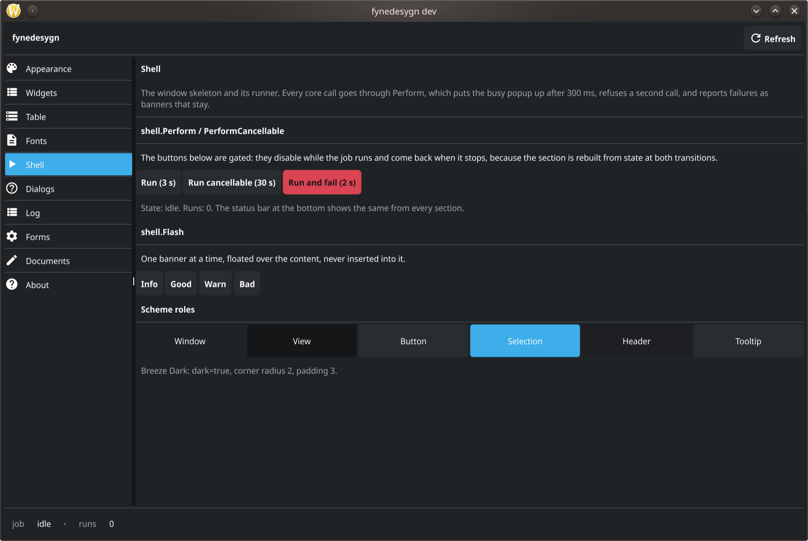
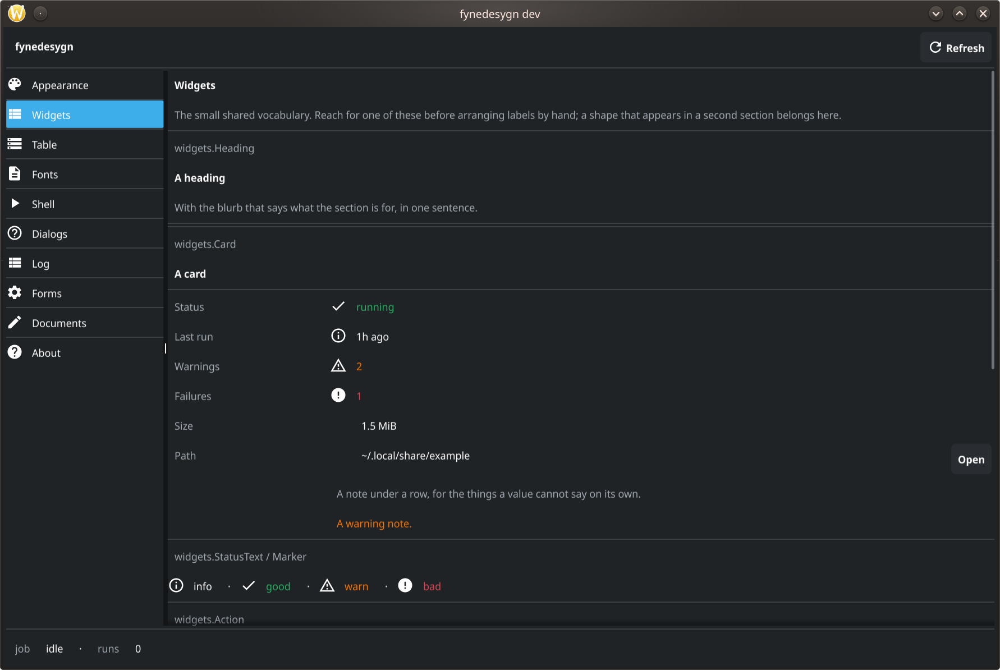
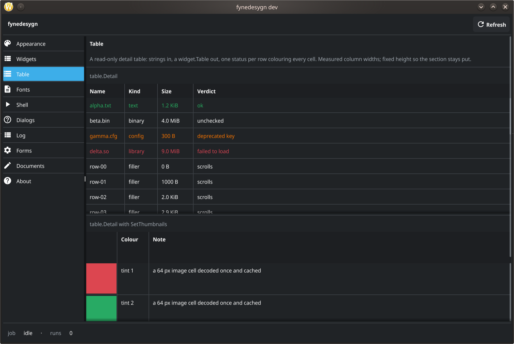
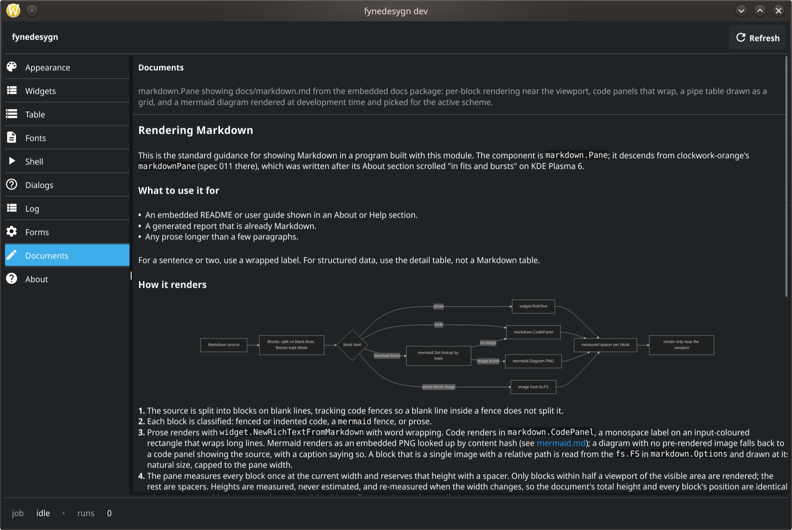
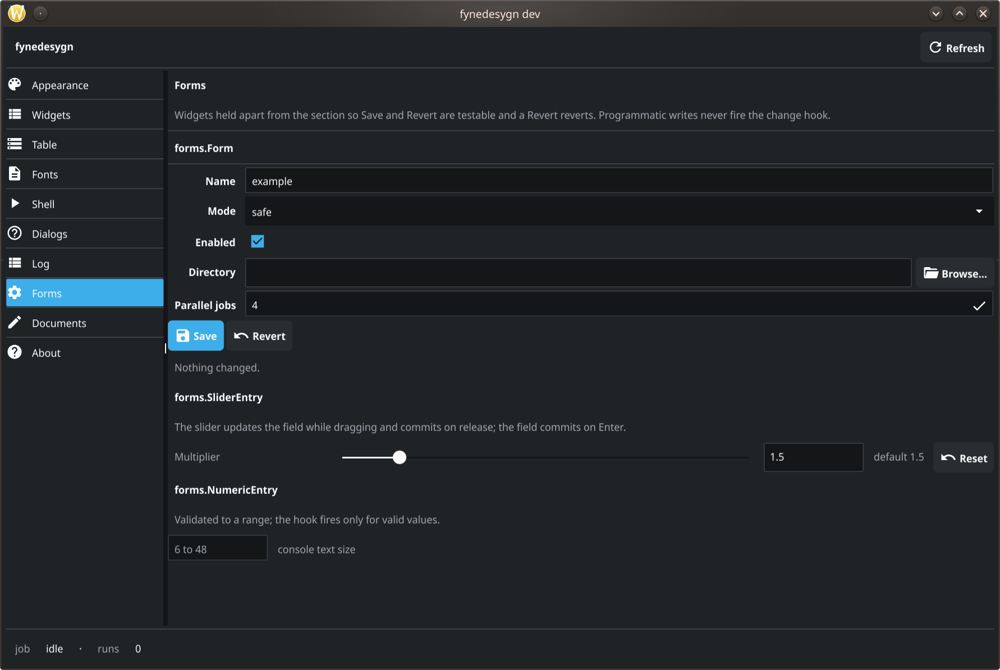
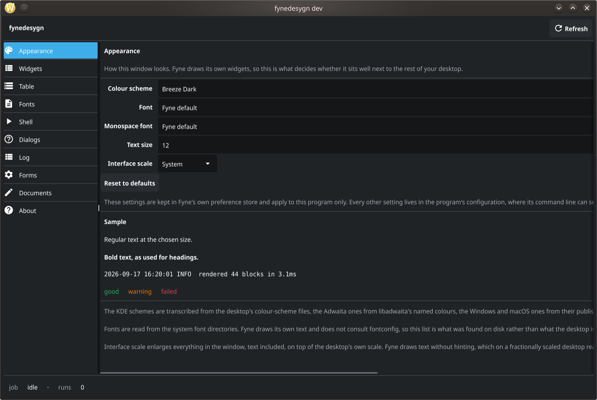
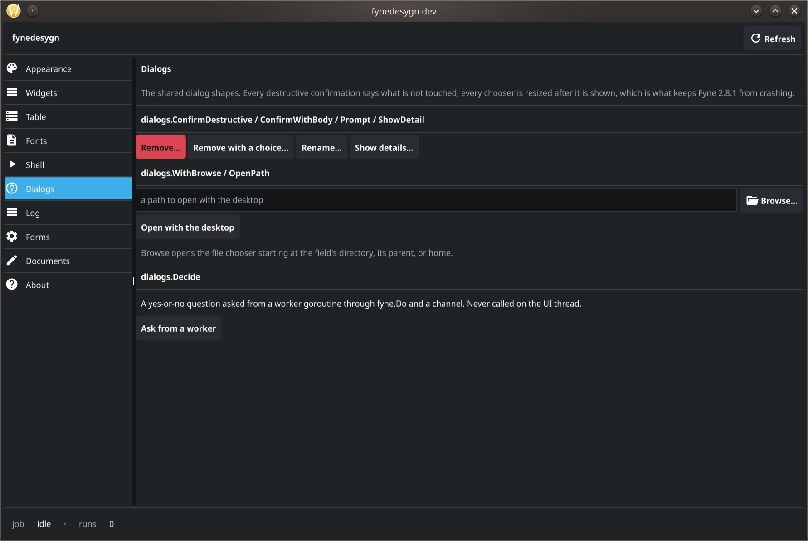
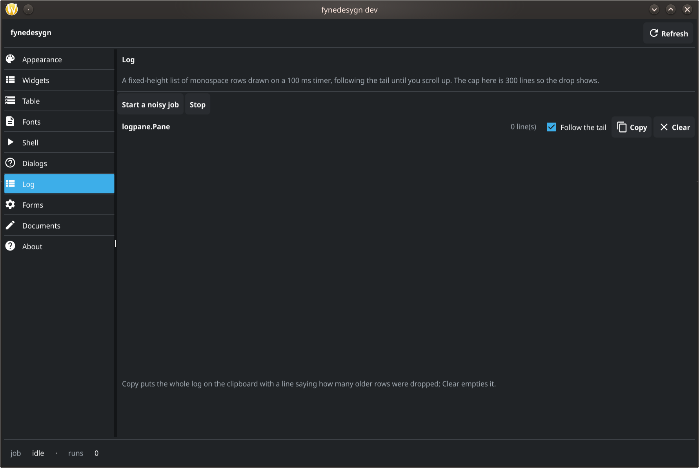
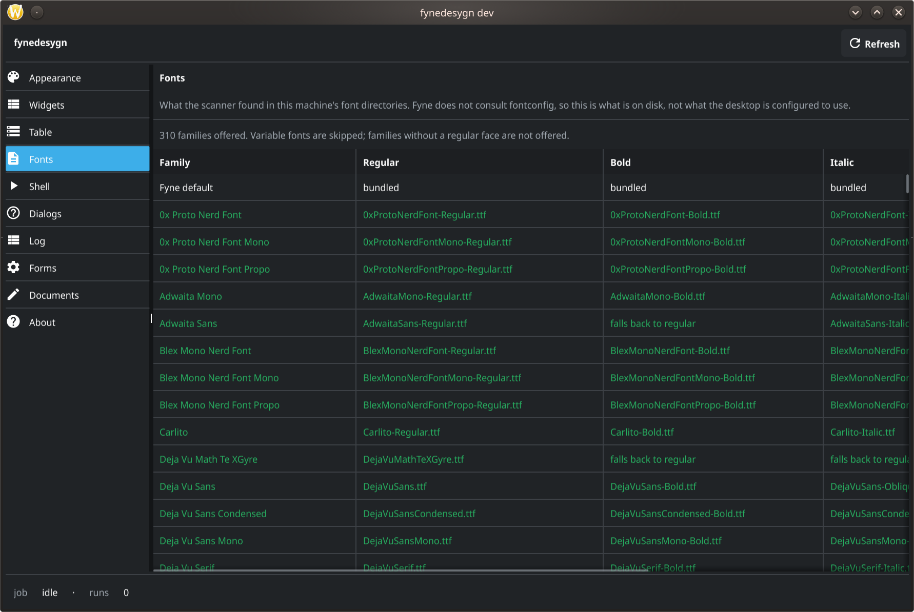
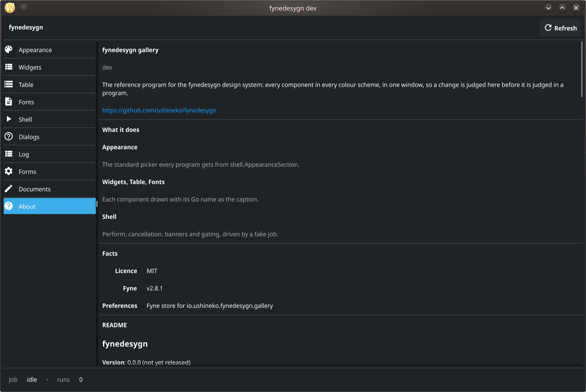

# fynedesygn

**Version**: 0.1.30

A design system and wrapper library for building desktop user interfaces with
[Fyne](https://fyne.io) in Go. It is the maintained home of the Fyne design
system that [angou](https://github.com/ushineko/angou),
[nmsbonker](https://github.com/ushineko/nmsbonker) and
[clockwork-orange](https://github.com/ushineko/clockwork-orange) carried as
hand-synced copies.

## Contents

- [What is in it](#what-is-in-it)
- [Screenshots](#screenshots)
- [Examples](#examples)
- [Used by](#used-by)
- [Status](#status)
- [Using it](#using-it)
- [Documentation](#documentation)
- [Development](#development)
- [Licence](#licence)
- [Changelog](#changelog)

## What is in it

| Package | Purpose |
|---|---|
| `fynedesygn` | Shared vocabulary: `Status`; the embedded README. |
| `theme` | Nine colour schemes (Breeze Dark and Light, Oxygen Dark, Adwaita Dark and Light, Windows Dark and Light, macOS Dark and Light), a `fyne.Theme` that applies them, system font discovery, appearance preferences, interface scale, the Linux cursor-theme fix. |
| `widgets` | The small shared primitives: headings, cards, fact rows, status text and markers, fixed-size wrappers, human-readable sizes and ages. |
| `table` | A read-only detail table with one status per row and measured column widths. |
| `logpane` | A mutex-guarded log model and a fixed-height monospace pane drawn on a timer with follow-tail, Copy and Clear. |
| `forms` | A form whose widgets are held apart from the section (Set never fires the change hook, so Revert reverts), the slider-and-entry pair that commits once per gesture, validated numeric entries. |
| `markdown` | A Markdown document pane that renders per block near the viewport, draws code blocks and pipe tables itself, resolves images from an `fs.FS`, and shows pre-rendered mermaid diagrams; `Section` for a document page. |
| `mermaid` | Hash-keyed lookup of pre-rendered diagram PNGs (light and dark), the widget that draws them, and the `mmdc` renderer and checker behind `go generate`. |
| `dialogs` | Destructive confirmation, prompt and detail dialogs, file and folder choosers that do not crash, the desktop opener, and a yes-or-no question a worker goroutine can ask. |
| `imagecache` | A bounded, shared cache of decoded images, so a section rebuilt on every visit does not decode its pictures again. Least-recently-used eviction by decoded bytes. |
| `profiling` | An opt-in pprof endpoint bound to loopback whatever address it is given, and a soft memory ceiling that defers to `GOMEMLIMIT`. See [Performance](docs/performance.md). |
| `settings` | A program's settings in one file the user can read: one section per top-level key, each decoded into the caller's own type, written a second after the last change. The file extension chooses the format. |
| `settings/yamlcodec` | YAML for `.yaml` and `.yml`, imported for its effect so a program that writes JSON carries no YAML parser. |
| `shell` | The window skeleton: header, section nav, content pane, status bar, busy indicator, banners, `Perform`, section lifecycle, plus the standard Appearance and About sections. |
| `glance` | The other window archetype: a frameless, always-on-top status panel sized to its content, with cards that hide when their source is silent, fixed-width value formatting, a sparkline and a quota meter. |
| `glance/kwin` | The KDE Plasma window rule a glance window needs — above, no border, and the opacity Fyne cannot draw itself. |
| `steps` | The step list a job shows beside its log, updated in place. |
| `fynetest` | Headless test helpers: tree walking, finders, text extraction, scrollable detection. |
| `cmd/fynedesygn-gallery` | The reference program. Every component in every scheme, with `--section` and `--scheme` for screenshots. |
| `cmd/fynedesygn-mermaid` | The `go generate` helper that renders missing diagrams; `-check` in CI fails on stale ones. |
| `docs` | The documents in `docs/` and their diagrams, embedded for the gallery. |
| `examples/` | Small programs, one per UI pattern; see [Examples](#examples). |
| `tools/` | The screenshot harness for KDE/Wayland. |

The rules the components follow are in
[docs/design-system.md](docs/design-system.md) for application windows and
[docs/glance.md](docs/glance.md) for glance windows.

## Screenshots

Captured from the gallery in Breeze Dark by `make screenshots`; refresh them
with the same command and check the alt text still matches.





















![The Glance section: the always-on-top panel vocabulary drawn at the width a real glance window uses, each piece captioned with its Go name — a live card, a card whose source has gone with its header marked "(unavailable)" and its values dimmed, a card with a two-trace sparkline under its rows, a card of four quota meters whose bars run green, green, amber and red as they approach their limits, a column of rows in four states, and each value formatter shown at three magnitudes in a monospace column.](docs/img/gallery-glance.png)

## Examples

Each example is a complete program with a headless test, in `examples/`, on
`shell.Run` unless noted. Build them all with `make build-examples`.

| Example | Pattern |
|---|---|
| `master-detail` | A table with one status per row, a detail card for the selected row, Refresh through `Perform`, a count in the status bar, and the loaded-flag pattern. |
| `settings` | A `forms.Form` over a JSON file, saved a second after the last change through `forms.Saver`, with Revert and the standard Appearance section. |
| `job-runner` | A `steps.List` beside a `logpane.Pane`, a job run through `PerformCancellable` that advances steps and logs, and one banner for the result. |
| `document-viewer` | `markdown.Section` over an embedded guide with a mermaid diagram rendered by `go generate`. |
| `glance-monitor` | Not a shell program: a `glance` panel of four cards — peripherals, bandwidth, a two-trace sparkline over thermals, and two quota meters — with a context menu as its only interface and the KDE window rule offered behind `-kwin`. |

## Used by

Four programs, all by the same author and all public. The first three carried
this design system as hand-synced copies before it was extracted, and are the
reason it exists; the fourth was built on the library from the start.

| Project | What it is | Role here |
|---|---|---|
| [clockwork-orange](https://github.com/ushineko/clockwork-orange) | Cross-platform wallpaper manager (KDE Plasma 6, Windows 10/11, macOS) | First adopter. The extraction was driven by its port, and it is the widest user of the shell |
| [nmsbonker](https://github.com/ushineko/nmsbonker) | No Man's Sky trainer and mod editor | Second adopter. `steps`, the log pane and the cancellable busy popup came from it |
| [angou](https://github.com/ushineko/angou) | Encryption tool for secrets | The origin. The rationale comments in `docs/design-system.md` are transcribed from its `internal/gui` |
| [terrariabonker](https://github.com/ushineko/terrariabonker) | Live-memory trainer for Terraria | Built on the library rather than migrated to it. Reported the table resize cost (spec 015) and asked for hover tips (spec 010) |

A component is done when one of these can delete its copy, which is why their
feedback has its own specs (006, 007) rather than being folded into the
features it changed.

Versions are deliberately not listed: they move independently and nothing here
can check them. `go.mod` in each repository is the answer.

## Status

Pre-release. The module is `v0.x` and the API changes as the three consuming
programs adopt it. Nothing here is stable until `v1.0.0`.

## Using it

```
go get github.com/ushineko/fynedesygn@latest
```

The library pins `fyne.io/fyne/v2 v2.8.1`. Building a Fyne program needs CGO
and, on Linux, the OpenGL and X11 or Wayland development headers. Running this
module's tests does not: they use the Fyne test driver.

## Documentation

- [Design system](docs/design-system.md): the layout rules and policies for
  application windows.
- [Performance](docs/performance.md): how to measure, how to read a Go heap
  profile, and what costs in a Fyne program. Read it before optimising
  anything: three readings of clockwork-orange's source gave three answers and
  one of them was wrong, where the profile took a minute.
- [Glance windows](docs/glance.md): the rules for frameless, always-on-top
  status panels, and the desktop integration they need.
- [Rendering Markdown](docs/markdown.md).
- [Mermaid diagrams](docs/mermaid.md).
- [Fyne quirks](docs/fyne-quirks.md): what the module works around and the
  canary test for each.

## Development

```
make setup     # install the pinned linter
make test      # headless, race detector
make lint
make gallery   # build the reference program for this machine
make generate  # render missing mermaid diagrams (needs mmdc)
make check-diagrams
make build-examples
make screenshots  # refresh docs/img from the gallery (KDE/Wayland)
make coverage
make vuln      # govulncheck, before every tagged release
```

Releasing: date the changelog's `Unreleased` heading, set the **Version** line
to match, run `make vuln`, land that commit on `main`, then push the tag and
publish a GitHub Release whose notes are that changelog entry. The steps are in
`.claude/CLAUDE.md`.

Work is specified in `specs/` and follows the conventions in
`.claude/CLAUDE.md`.

## Licence

MIT. See [LICENSE](LICENSE).

## Changelog

Every release has an entry, and the **Version** line at the top of this file
names the latest tag. Both are updated in the same commit as the change they
describe -- see `.claude/CLAUDE.md`.

### 0.1.30 (2026-09-21)

- `markdown.Pane` measures a block after giving it its width, not before. A
  paragraph's height is a property of the paragraph *and* the width it is
  given, and a mermaid diagram derives its height from the width it was last
  resized to, so the first measurement of a fresh pane reserved about two
  thirds of the height the document draws as. Everything below a mis-measured
  block sat above where it would be drawn, and the page moved when a width
  change finally measured it properly. Spec 015 removed that second `MinSize`
  as a rider on a performance change (spec 021, #21).

- `shell.AboutSection` no longer wraps its page in a scroller. The shell
  already scrolls what a section builds, so an About page was a scroll inside
  a scroll — and `About.Extra`, whose documented purpose is an embedded README
  that follows the content scroller, was handing that pane the outer scroller
  while sitting in the inner one: one screenful of document over the blank
  height of the rest. Found in hotaru (spec 020, #19).

- `settings` no longer renames a file it cannot parse. An unreadable file is
  reported through a new `*settings.ParseError` carrying the path and the
  codec's own error — which knows the line and column — and is left exactly
  where its owner put it. The store serves reads from defaults so a program
  still runs, and refuses to save until the caller calls `Replace`, because
  overwriting a file nobody could read destroys the thing its owner needs to
  fix. `Unreadable` reports the condition without waiting for a failed `Set`.
  Supersedes spec 011's R6/AC5 (spec 019, #15).

### 0.1.29 (2026-09-19)

`markdown.Options.SettleResize` coalesces the re-measure a width change forces.
Zero, the default, measures on every change as before.

Fyne hands a widget a Resize for every step of a drag, from inside the event
poll, and measuring a document means rendering every block to ask its height.
A profile of clockwork-orange's About section under a drag put 32% of all CPU
in `markdown.(*Pane).measure`, arriving through `glfwPollEvents ->
processResized`: Fyne relays out synchronously inside the event poll, so the
queue cannot drain while it runs and the window moves in bursts. With a settle
set, a drag is waited out and measured once. A change of a quarter or more is a
jump rather than a drag -- a section shown, a window maximised, a first layout
-- and is measured at once, because delaying that would show the document at
the wrong heights for no gain.

Opt-in like `logpane.Pump`, because the work runs on a timer and returns to the
UI thread with `fyne.Do`: a real hop in a real program, an inline call under
the test driver. A pane that scheduled timers by itself ran text shaping on a
timer goroutine in every headless test that resized a window, which the race
detector caught in this module's own gallery.

`measure` also asks each block its `MinSize` once rather than twice; it is the
call that shapes the block's text.

### 0.1.28 (2026-09-19)

A second window archetype: **glance windows**, small frameless always-on-top
panels sized to their content and read without being interacted with. Where
`shell` builds a window someone works in -- header, navigation, content
scroller, status bar -- a glance window has none of that: the window is the
content, a stack of cards each of which is either worth a glance or not drawn
at all. Transcribed from `ag-scripts/peripheral-battery-monitor`, which has
carried the shape through its 1.x series. Specs 016 and 017.

`glance` holds the window, the card stack, the rows, the fixed-width value
formatting, a sparkline and a quota meter. Values go through `Rate`, `Size`,
`Percent`, `Quantity` and `Count` rather than `fmt`, because a window sized to
its content is a window a number can resize by crossing a magnitude; each has a
matching blank of the same width for a reading that has not arrived.
`glance/kwin` writes the KDE Plasma window rule for the three things the
compositor grants and Fyne cannot ask for: staying above, losing the titlebar,
and opacity.

Quirks 32, 33 and 34: no translucent window on the desktop backend, no way to
read a window's own position back, and a fixed-size window that grows to its
content and never shrinks without being told. The first two have no workaround
in the process and shape the design rather than being worked around; the third
is why `Panel.Resize` exists.

`glance.Sparkline` reuses its line segments instead of rebuilding them. A plot
of two traces over sixty samples is 118 segments and `Add` refreshes on every
sample, so the cost of drawing a plot was proportional to how often it was fed.
2397 ns and 118 allocations per refresh before, 357 ns and none after, pinned by
`BenchmarkSparklineRefresh` and `TestRefreshingAPlotAllocatesNothing`.

This README had drifted twenty-four releases: the **Version** line said 0.1.3
against a latest tag of v0.1.27, the `settings` packages had never reached the
package table though they have shipped since 0.1.10, four gallery screenshots
were displayed nowhere so their alt text had never been checked, and two specs'
worth of work had no entry here at all. Nothing builds this file and nothing
read it, so it drifted until a reader found it.

`readme_test.go` holds seven canaries for that now -- a package missing from
the table, a document not linked, a screenshot shown nowhere, a `make` target
undocumented, a Version line behind the changelog, a changelog whose shape has
changed, a section missing from Contents. Each was checked by breaking the
thing it guards, and one was blind on the first attempt. The rule they enforce
is in `.claude/CLAUDE.md`. Spec 018.

A "Used by" section names the four programs built on this library, one of
which the project's own record had lost: terrariabonker has been on it since
before v0.1.27 and appeared only in changelog entries.

Additive. Nothing outside `glance` changed behaviour; `docs/design-system.md`,
this README and the root `doc.go` gained cross-references, and the gallery
gained a Glance section.

### 0.1.27 (2026-09-19)

A table no longer re-shapes its text every time it is resized. Fyne resizes
every visible cell on each layout, and a `widget.Label` with wrapping or
truncation on re-shapes its text through harfbuzz when it is resized -- for text
that has not changed, only a width that has. Dragging a window that showed a
table stalled for seconds: profiled on a consumer's 7-column catalog, 42% of the
process's CPU was in `RichText.updateRowBounds` and another 36% in the GC behind
it.

Cells and headers now take the one path in Fyne that returns without measuring
-- wrapping and truncation both off -- and the table cuts its own ellipsis with
the rune metric its column widths have always used. A 300-row table resizes in
27 microseconds where it took 738, pinned by `table.BenchmarkResize`.

Not a breaking change, and no API moved. The visible difference is that a
truncated cell may now cut a character earlier or later than Fyne would have:
the cut is by rune count rather than by measurement, which is the same
approximation that has sized the columns since `Measure` was written.

Quirks 30 and 31 in `docs/fyne-quirks.md`: the re-shaping above, and a second
one a consumer must act on itself -- Fyne asks which goroutine it is on by
taking a stack traceback, on every canvas refresh, unless the app builds with
`-tags migrated_fynedo`. That was 52% of a consumer's CPU during a drag. Every
program on this library already hops to the UI thread with `fyne.Do`, which is
what the tag asserts, so they should all carry it.

### 0.1.26 (2026-09-19)

A control that starts, cancels or commits work is affixed: it keeps its place
however much of its section is scrolled, and what scrolls is the material it
acts on. The design system held both halves of this and never joined them -- the
cause under "One scroll per section" (the wheel goes to the innermost
scrollable under the pointer, so a control you must scroll to may be
unreachable, not merely hidden), the shape under "Sections". Stated as a shape
it only reached an author who had already decided they needed it, and three
sections broke it afterwards: two in clockwork-orange, one of which shipped
with no visible way to stop the service it reported as running, and the Log
section of this module's own gallery.

`fynetest.Scrolled[T]` and `ScrolledButtons` are the check -- a named control
must not appear in them. The library ships the primitive and not the policy,
because only the program knows which of its buttons is a section's action and
which belongs to a row.

Behaviour change: `fynetest.Walk`, and so `All` and `First`, now descend
`container.Split`. A split is a widget with two exported halves, so a
structural walk stopped at it, and since `Shell.VSplit` every section with a
pane under a divider is one. A test that asserted an exact count of objects
under a split will see more of them.

### 0.1.25 (2026-09-18)

`fynetest.All` and `First`: find the widgets a list or a dialog actually drew,
through the cached renderer. A walker that descends through `CreateRenderer`
reads a tree that was never on screen, because `CreateRenderer` builds one
(quirk 29). `widgets`' own tip-layer lookup no longer calls it either.

### 0.1.24 (2026-09-18)

`widgets.PickList` hands out the list itself (`Widget()`) rather than being a
widget wrapping one. A wrapper has to pass on everything its container does, and
a list that is resized but never laid out builds no rows: it draws as an empty
space that lays out correctly.

### 0.1.22 (2026-09-18)

`widgets.PickList`: a list whose rows can be ticked, for an action on several at
once. Fyne's list selects one row, which is right for a list being read and
wrong for one being edited.

### 0.1.21 (2026-09-18)

A refused operation is explained only when the explanation is needed. The busy
popup is modal, so while it is up a click cannot reach a control and there is
nothing to say — the banner was sitting on screen for twelve seconds after the
work it described had finished. `Shell.SayBusy` replaces the direct `Flash`, and
says it as an Info rather than a Warn.

### 0.1.20 (2026-09-18)

A refused operation says what is running. "Something is already running" told
the user nothing they could act on; the banner now names the operation holding
the indicator and offers Cancel only when that operation has one.
`Shell.BusyWhat` and `Shell.BusyReason` are exported for a program that gates
its own buttons.

### 0.1.19 (2026-09-18)

Fix: a log pane did not reflow when the window or the divider above it moved. It
wrapped to whatever width it was first drawn at and stayed there. Two things
were wrong and the second hid the first: the pane had no way to learn its width
had changed, and `widget.List` will not re-run the update for a row index it
already has, so even a correct rewrap left the first row drawn at the old width
while the rest of the line appeared underneath it.

### 0.1.18 (2026-09-18)

A wrapped log line's continuation rows are indented and marked, so where a
message starts is visible without reading it.

### 0.1.17 (2026-09-18)

Fix: the wrapping added in 0.1.16 never ran. It hung off `Draw`, which runs on
the pump's tick, and most panes are never pumped — a section that rebuilds on
its own redraws the log with it. The test that passed called `Draw` itself,
which is a path the caller does not take. The wrapping is in the list's length
function now, which is reached however the pane is driven, and the test builds
the widget and refreshes it the way a section does.

### 0.1.16 (2026-09-18)

`logpane` wraps. A line longer than the pane was drawn past the right edge and
the rest of it could not be read at all. Every row is still one line of
monospace text in a `widget.List` -- that is what makes a long log scroll like a
terminal -- so the wrapping is done in the pane's own terms: a long line becomes
several rows of the same height. Copy still renders the model, so a line broken
for the screen arrives whole on the clipboard.

### 0.1.15 (2026-09-18)

Fix: a result banner was unreadable over a busy section. The status tint is
translucent so text stays legible over it, which was fine while a banner was a
popup drawing an opaque background of its own; moved into a layer of the content
in 0.1.13 it had nothing underneath but the section, and a log behind it read
straight through the message. Banners now bring their own background and a
hairline edge, and every layer fades together.

### 0.1.14 (2026-09-18)

`widgets.TipDelay` is a second, up from half of one. Half a second is about how
long it takes to move the pointer onto a button and press it, so a tip arrived
at the moment of the click on controls nobody was asking about.

### 0.1.13 (2026-09-18)

Fix: a result banner took every click in the window while it was up. Same cause
as the tip in 0.1.12 — a banner was a popup, and a popup is an overlay — but for
six to twelve seconds after every operation, and the first click dismissed the
banner instead of doing what it was aimed at. Banners are drawn in a layer of
the content now; their own dismiss still works. The busy popup stays an overlay,
because blocking input is what it is for.

Fix: a tip stayed up when its control opened a menu or a dialog, because the
pointer never left it. `widgets.HideTips` takes down every tip, shown or
waiting, and the shell's controls and every dialog call it before they open.
Quirk 27.

### 0.1.12 (2026-09-18)

Fix: a hover tip took every click in the window while it was showing. A tip was
a popup, a popup is an overlay, and Fyne routes pointer events to the top
overlay instead of to the content — so a control whose own tip was up needed two
clicks, and the first only took the tip down. Tips are now drawn in a layer at
the top of the window's content (`widgets.NewTipLayer`, which the shell provides
for every window it builds), where the walk that finds what was clicked skips
them. Quirk 26.

### 0.1.11 (2026-09-18)

Fix: the navigation's shape menu opened in the corner of the window rather than
under the button that raises it. A widget's `Position` is measured from its
parent, so the button in the header's row reported a position near the origin of
that row.

### 0.1.10 (2026-09-18)

`settings.Store` and `Shell.Settings()`: a program's settings in one file the
user can read, one section per key, decoded into the caller's own type
(spec 011). The extension chooses the format — JSON in the core,
`settings/yamlcodec` for `.yaml` and `.yml`. Sections a build does not know are
kept rather than dropped. The appearance moves into it, read once from
`fyne.Preferences` for an installation that predates the file.

`Shell.Stop` runs `Options.OnStop` and writes pending settings when the window
closes, not only before a restart, and runs once however many times it is
called.

The navigation's shape (spec 013): icons and labels, icons alone or hidden, down
the left or along the top, with one stock control in the header and `Ctrl+B` to
hide. A program declares which shapes it allows through `Options.NavModes` and
`NavPlacements`; one that declares nothing keeps exactly the window it has, with
no control and no shortcut.

`Shell.VSplit` and `HSplit`: a divider the user can drag whose position outlives
the section that drew it and the run that set it (spec 012). Fyne's split
reports no drag and a section is rebuilt several times a minute, so the shell
reads each live divider before the content holding it is replaced. The
navigation's own divider goes through the same call, so the width of the section
list is now something the user can keep. `logpane.Options.Height` is documented
as a minimum rather than a size.

### 0.1.9 (2026-09-18)

Fix: `widgets.FixedWidth` and `FixedHeight` padded with a nil-coloured
rectangle, which is invisible under the GL painter and a nil dereference under
the software one. Every window built with them worked and could not be rendered
to an image, which is what a headless layout check needs. Quirk 25.

### 0.1.8 (2026-09-18)

Fix: the hover tip's catcher had the same nil fill, with the same effect.

### 0.1.7 (2026-09-18)

Fix: a long hover tip was drawn one line tall with its text outside the box. A
wrapping label reports a minimum width of about one character and does not know
its height until it has a width, so a tip is measured after being resized.

### 0.1.6 (2026-09-18)

`widgets.WithTip` (spec 010): a hover note for the guidance a control cannot
fit in its label. Fyne has no tooltip; this stacks a transparent catcher over
the control, which takes the hover while taps walk past it to the control
underneath. Asked for by terrariabonker's port, whose Qt panel keeps twenty-odd
of these. Additive.

### 0.1.5 (2026-09-17)

`shell.Arriver` (spec 009): the shell now tells a section whether it is being
built because the navigation arrived at it or because it is being rebuilt
where it stands. A section that refetches on arrival needs the difference —
refetching in the builder loops, because the fetch finishing rebuilds the
section that started it. Found in angou's adoption, which had worked around
it by remembering the last section title. Additive; `Section` is unchanged
and `Arriver` is optional.

### 0.1.4 (2026-09-17)

`shell.BusyCancellable` (spec 008): a job that holds the busy indicator itself
can put its Cancel on the popup. The popup is modal, so a Cancel left enabled
in the toolbar behind it could not be clicked — found in nmsbonker's build
section, where it had been unreachable since before the adoption. Additive;
`PerformCancellable` now runs through the same path.

### 0.1.3 (2026-09-18)

Second adopter feedback (spec 007): `steps.Advance` never reopens a finished
step, `steps.NewSteps` with standing notes that `Reset` keeps,
`logpane.Pane.SetFollowing`, `shell.Load`, `shell.About.URLText`. Behaviour
change: `forms.SliderEntry` passes a typed value to `Commit` as typed (the
controls still show it clamped) so a program can clamp and report itself.

### 0.1.2 (2026-09-18)

Fix: the Appearance section's notes were unwrapped labels, so the section's
minimum width was the whole line and the window scrolled sideways (seen on
Windows in clockwork-orange 4.1.0). New `widgets.DimWrapped` for secondary
paragraphs; every long note uses it; a test holds the section to a 500 px
viewport.

### 0.1.1 (2026-09-18)

Hooks the first adopter needed: `shell.Options.OnCreate`, `Theme` and
`OnTypedKey` (spec 006). Additive.

### 0.1.0 (2026-09-18)

First tagged release, for the first adopter (clockwork-orange). Packages
`theme` (nine schemes), `shell`, `widgets`, `table`, `steps`, `markdown`,
`mermaid`, `docs`, `dialogs`, `logpane`, `forms`, `fynetest`; the gallery,
the mermaid command, four examples and the screenshot harness. The API is
`v0` and changes as the three programs adopt it.
