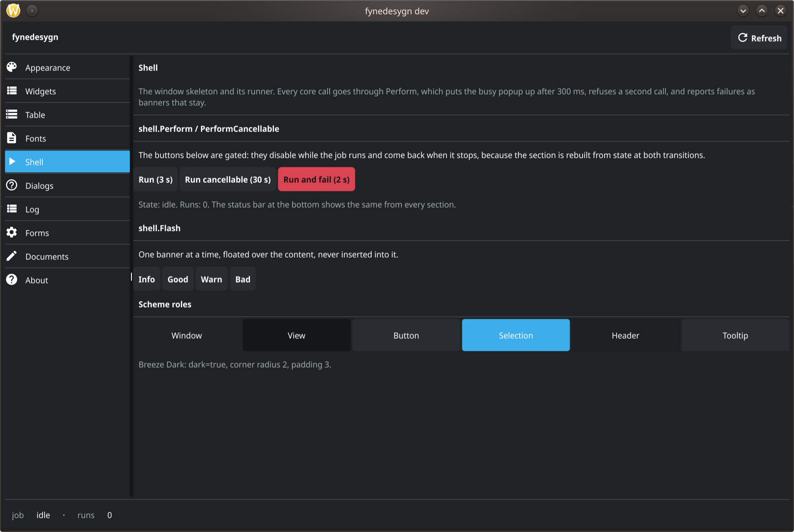
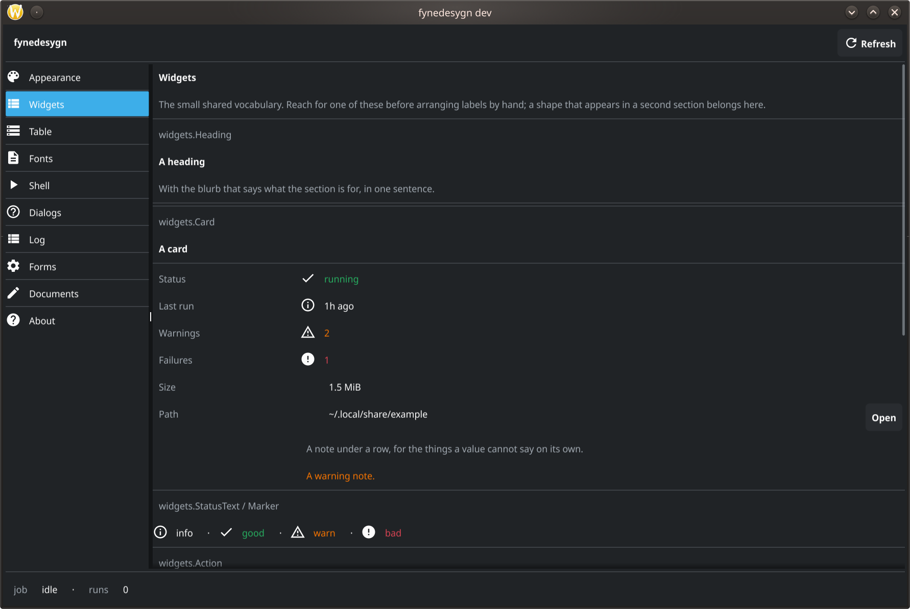
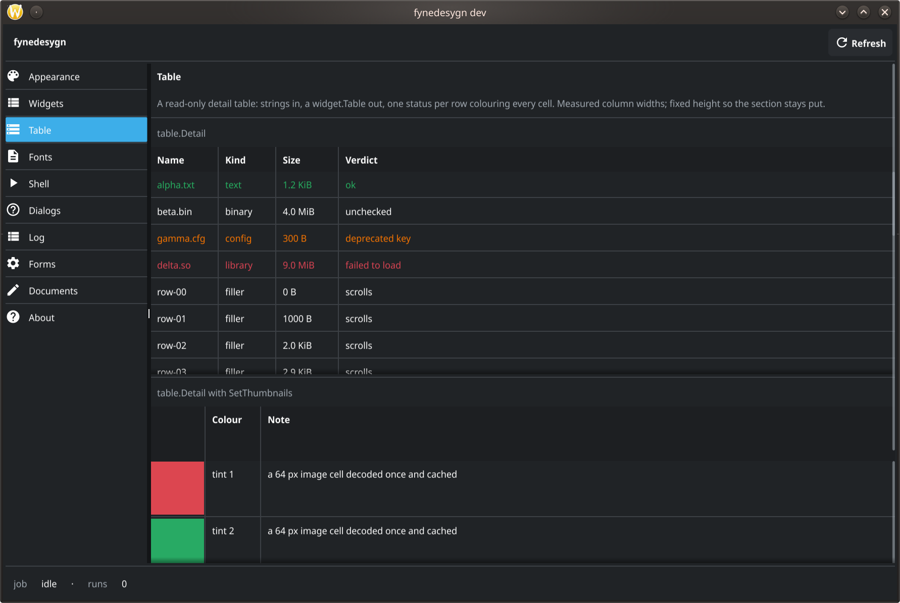
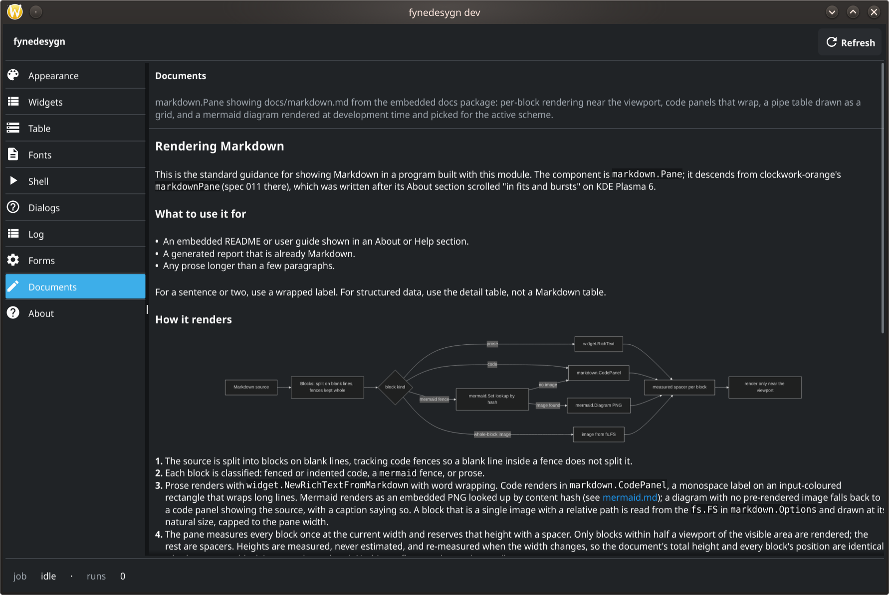
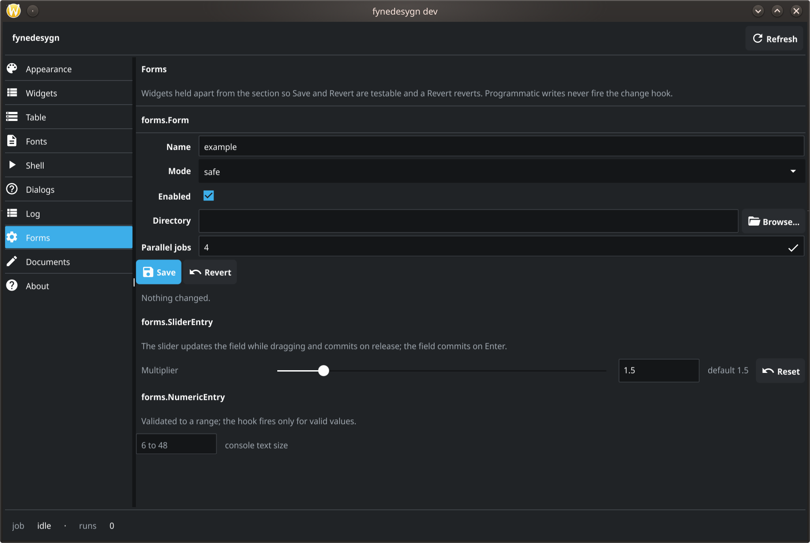
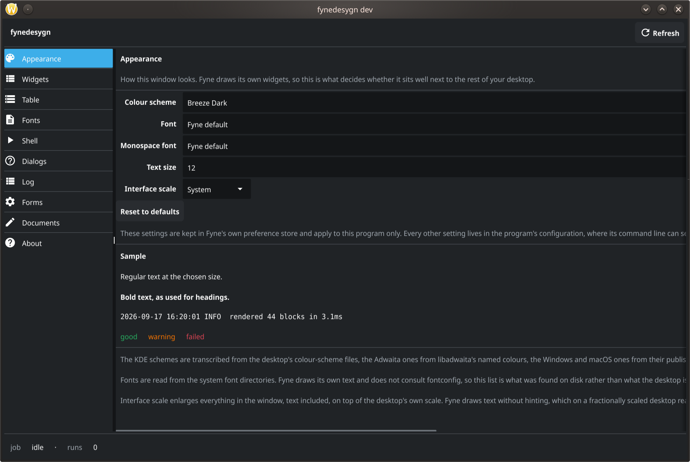
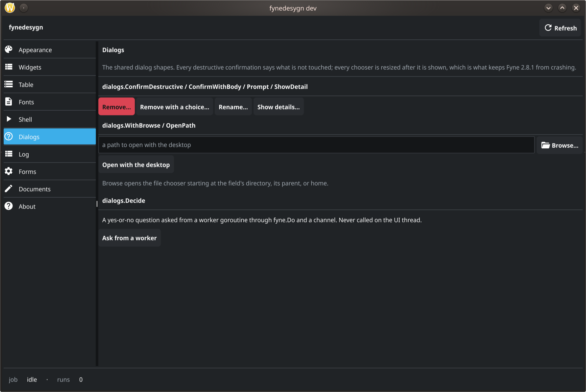
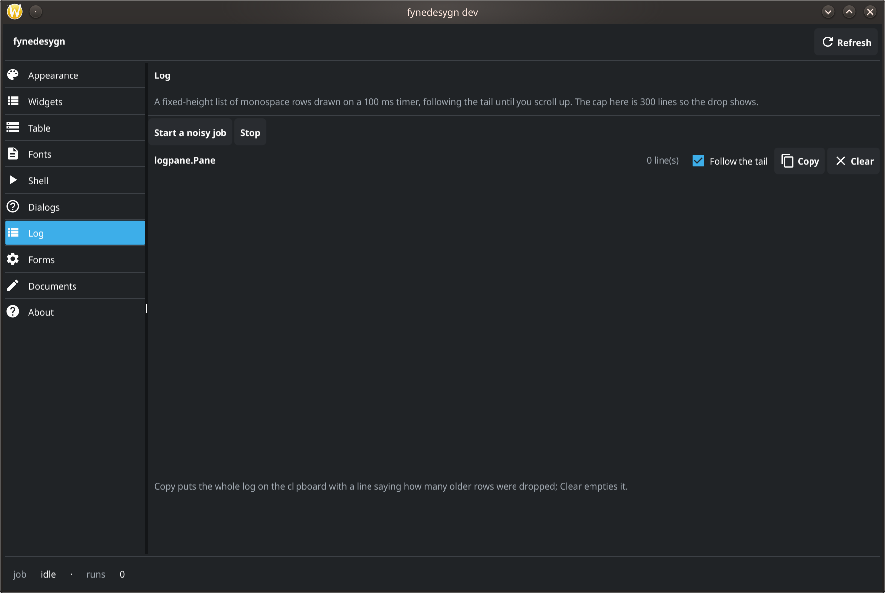
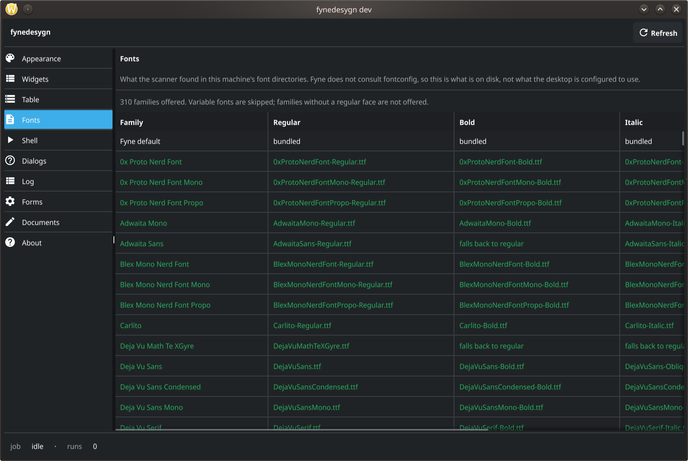
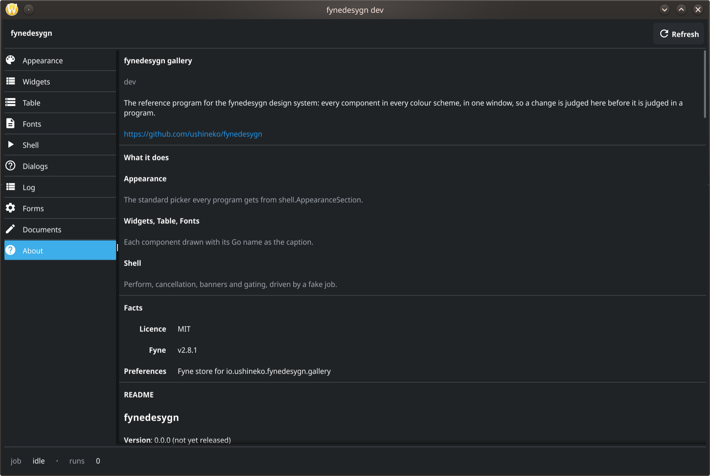

# fynedesygn

[](https://pkg.go.dev/github.com/ushineko/fynedesygn)

**Version**: 0.1.80

A design system and wrapper library for building desktop user interfaces with
[Fyne](https://fyne.io) in Go. It is the maintained home of the Fyne design
system that [angou](https://github.com/ushineko/angou),
[nmsbonker](https://github.com/ushineko/nmsbonker) and
[clockwork-orange](https://github.com/ushineko/clockwork-orange) carried as
hand-synced copies.

## Contents

- [What is in it](#what-is-in-it)
- [Screenshots](#screenshots)
- [Examples](#examples)
- [Used by](#used-by)
- [Status](#status)
- [Using it](#using-it)
- [Tutorial](#tutorial)
- [Documentation](#documentation)
- [Development](#development)
- [Licence](#licence)
- [Changelog](#changelog)

## What is in it

| Package | Purpose |
|---|---|
| [`fynedesygn`](https://pkg.go.dev/github.com/ushineko/fynedesygn) | Shared vocabulary: `Status`; the embedded README. |
| [`theme`](https://pkg.go.dev/github.com/ushineko/fynedesygn/theme) | Nine colour schemes (Breeze Dark and Light, Oxygen Dark, Adwaita Dark and Light, Windows Dark and Light, macOS Dark and Light), a `fyne.Theme` that applies them, system font discovery, appearance preferences, interface scale, the Linux cursor-theme fix. |
| [`widgets`](https://pkg.go.dev/github.com/ushineko/fynedesygn/widgets) | The small shared primitives: headings, cards, fact rows, status text and markers, fixed-size wrappers, human-readable sizes and ages. |
| [`table`](https://pkg.go.dev/github.com/ushineko/fynedesygn/table) | A read-only detail table with one status per row and measured column widths. |
| [`logpane`](https://pkg.go.dev/github.com/ushineko/fynedesygn/logpane) | A mutex-guarded log model and a fixed-height monospace pane drawn on a timer with follow-tail, Copy and Clear. |
| [`forms`](https://pkg.go.dev/github.com/ushineko/fynedesygn/forms) | A form whose widgets are held apart from the section (Set never fires the change hook, so Revert reverts), the slider-and-entry pair that commits once per gesture, validated numeric entries. |
| [`markdown`](https://pkg.go.dev/github.com/ushineko/fynedesygn/markdown) | A Markdown document pane that renders per block near the viewport, draws code blocks and pipe tables itself, resolves images from an `fs.FS`, and shows pre-rendered mermaid diagrams; `Section` for a document page. |
| [`mermaid`](https://pkg.go.dev/github.com/ushineko/fynedesygn/mermaid) | Hash-keyed lookup of pre-rendered diagram PNGs (light and dark), the widget that draws them, and the `mmdc` renderer and checker behind `go generate`. |
| [`dialogs`](https://pkg.go.dev/github.com/ushineko/fynedesygn/dialogs) | Destructive confirmation, prompt and detail dialogs, file and folder choosers that do not crash, the desktop opener, and a yes-or-no question a worker goroutine can ask. |
| [`imagecache`](https://pkg.go.dev/github.com/ushineko/fynedesygn/imagecache) | A bounded, shared cache of decoded images, so a section rebuilt on every visit does not decode its pictures again. Least-recently-used eviction by decoded bytes. |
| [`profiling`](https://pkg.go.dev/github.com/ushineko/fynedesygn/profiling) | An opt-in pprof endpoint bound to loopback whatever address it is given, and a soft memory ceiling that defers to `GOMEMLIMIT`. See [Performance](docs/performance.md). |
| [`settings`](https://pkg.go.dev/github.com/ushineko/fynedesygn/settings) | A program's settings in one file the user can read: one section per top-level key, each decoded into the caller's own type, written a second after the last change. The file extension chooses the format. |
| [`settings/yamlcodec`](https://pkg.go.dev/github.com/ushineko/fynedesygn/settings/yamlcodec) | YAML for `.yaml` and `.yml`, imported for its effect so a program that writes JSON carries no YAML parser. |
| [`shell`](https://pkg.go.dev/github.com/ushineko/fynedesygn/shell) | The window skeleton: header, section nav, content pane, status bar, busy indicator, banners, `Perform`, section lifecycle, plus the standard Appearance and About sections. |
| [`glance`](https://pkg.go.dev/github.com/ushineko/fynedesygn/glance) | The other window archetype: a frameless, always-on-top status panel sized to its content, with cards that hide when their source is silent, fixed-width value formatting, a sparkline and a quota meter. |
| [`glance/kwin`](https://pkg.go.dev/github.com/ushineko/fynedesygn/glance/kwin) | The KDE Plasma window rule a glance window needs — above, no border, and the opacity Fyne cannot draw itself. |
| [`steps`](https://pkg.go.dev/github.com/ushineko/fynedesygn/steps) | The step list a job shows beside its log, updated in place. |
| [`fynetest`](https://pkg.go.dev/github.com/ushineko/fynedesygn/fynetest) | Headless test helpers: tree walking, finders, text extraction, scrollable detection. |
| [`cmd/fynedesygn-gallery`](https://pkg.go.dev/github.com/ushineko/fynedesygn/cmd/fynedesygn-gallery) | The reference program. Every component in every scheme, with `--section` and `--scheme` for screenshots. |
| [`cmd/fynedesygn-mermaid`](https://pkg.go.dev/github.com/ushineko/fynedesygn/cmd/fynedesygn-mermaid) | The `go generate` helper that renders missing diagrams; `-check` in CI fails on stale ones. |
| [`docs`](https://pkg.go.dev/github.com/ushineko/fynedesygn/docs) | The documents in `docs/` and their diagrams, embedded for the gallery. |
| `examples/` | Small programs, one per UI pattern; see [Examples](#examples). |
| `tools/` | The screenshot harness for KDE/Wayland. |

The rules the components follow are in
[docs/design-system.md](docs/design-system.md) for application windows and
[docs/glance.md](docs/glance.md) for glance windows.

## Screenshots

Captured from the gallery in Breeze Dark by `make screenshots`; refresh them
with the same command and check the alt text still matches.





















![The Glance section: the always-on-top panel vocabulary drawn at the width a real glance window uses, each piece captioned with its Go name — a live card, a card of four peripheral cells with a bar under each battery level — green, green and red — and none under the keyboard that has no reading, a card whose source has gone with its header marked "(unavailable)" and its values dimmed, a card with a two-trace sparkline under its rows, a bare sparkline of two interfaces' down and up rates on one shared scale, one interface in the scheme's link blue and the other in violet, each with its upload a faded copy of it and the quieter interface a low line along the floor, a card of four quota meters whose bars run green, green, amber and red as they approach their limits, a column of rows in four states, and each value formatter shown at three magnitudes in a monospace column.](docs/img/gallery-glance.png)

## Examples

Each example is a complete program with a headless test, in `examples/`, on
`shell.Run` unless noted. Build them all with `make build-examples`.

| Example | Pattern |
|---|---|
| `master-detail` | A table with one status per row, a detail card for the selected row, Refresh through `Perform`, a count in the status bar, and the loaded-flag pattern. |
| `settings` | A `forms.Form` over a JSON file, saved a second after the last change through `forms.Saver`, with Revert and the standard Appearance section. |
| `job-runner` | A `steps.List` beside a `logpane.Pane`, a job run through `PerformCancellable` that advances steps and logs, and one banner for the result. |
| `document-viewer` | `markdown.Section` over an embedded guide with a mermaid diagram rendered by `go generate`. |
| `glance-monitor` | Not a shell program: a `glance` panel of four cards — peripherals, bandwidth, a two-trace sparkline over thermals, and two quota meters — with a context menu as its only interface and the KDE window rule offered behind `-kwin`. |

## Used by

Seven programs, all by the same author and all public. The first three
carried this design system as hand-synced copies before it was extracted,
and are the reason it exists; the others were built on the library.

| Project | What it is | Role here |
|---|---|---|
| [clockwork-orange](https://github.com/ushineko/clockwork-orange) | Cross-platform wallpaper manager (KDE Plasma 6, Windows 10/11, macOS) | First adopter. The extraction was driven by its port, and it is the widest user of the shell |
| [nmsbonker](https://github.com/ushineko/nmsbonker) | No Man's Sky trainer and mod editor | Second adopter. `steps`, the log pane and the cancellable busy popup came from it |
| [angou](https://github.com/ushineko/angou) | Encryption tool for secrets | The origin. The rationale comments in `docs/design-system.md` are transcribed from its `internal/gui` |
| [terrariabonker](https://github.com/ushineko/terrariabonker) | Live-memory trainer for Terraria | Built on the library rather than migrated to it. Reported the table resize cost (spec 015) and asked for hover tips (spec 010) |
| [hayami](https://github.com/ushineko/hayami) | Glance panel for Linux: peripheral batteries, bandwidth, cooler thermals, Claude Code and Codex usage, on the desktop and in a terminal | The `glance` package exists for it (specs 016, 017, 038–048, 051): the frameless always-on-top window, cards, rows in coloured parts with pinned labels, cells with bars, meters, the shared-scale sparkline and series colours, and the restyle fix. Also `settings`, `markdown` and `glance/kwin` |
| [hotaru](https://github.com/ushineko/hotaru) | RGB lighting and AIO cooler control for Linux, with a live dashboard on the cooler's LCD | Drove `settings` (spec 011) and the shell's program-settings, section-arrival and affixed-controls work (specs 019–028); uses `steps`, `logpane` and `dialogs` |
| [ototo](https://github.com/ushineko/ototo) | Audio-output switcher that lives in the tray and follows the best connected output | A shell-and-widgets consumer; spec 035 came from it |

A component is done when one of these can delete its copy, which is why their
feedback has its own specs (006, 007) rather than being folded into the
features it changed.

Versions are deliberately not listed: they move independently and nothing here
can check them. `go.mod` in each repository is the answer.

## Status

Pre-release. The module is `v0.x` and the API changes as the three consuming
programs adopt it. Nothing here is stable until `v1.0.0`.

## Using it

```
go get github.com/ushineko/fynedesygn@latest
```

The library pins `fyne.io/fyne/v2 v2.8.1`. Building a Fyne program needs CGO
and, on Linux, the OpenGL and X11 or Wayland development headers. Running this
module's tests does not: they use the Fyne test driver.

The API reference is on
[pkg.go.dev](https://pkg.go.dev/github.com/ushineko/fynedesygn), and every
package in the table above links to its own page there.

## Tutorial

The whole of a program is a `shell.Options` and a call to `shell.Run`. This is
[`examples/document-viewer/main.go`](examples/document-viewer/main.go) in full
— forty-four lines, built by `make build-examples` and covered by a headless
test, so it is a thing that runs rather than a thing that reads well.

**A window is a list of sections.**

```go
func main() { shell.Run(options()) }
```

`Run` builds the window, restores the appearance the user chose last time, and
blocks until it closes. Everything a program decides, it decides in the
`Options` it hands over.

```go
func options() shell.Options {
	guide, _ := content.ReadFile("guide.md")
	opts := markdown.Options{FS: content, Diagrams: mermaid.NewSet(content, "diagrams")}
	return shell.Options{
		AppID: "io.ushineko.fynedesygn.example.docviewer",
		Name:  "document-viewer",
		Sections: []shell.Section{
			markdown.Section("Guide", fynetheme.DocumentIcon, string(guide), opts, func(*shell.Shell) fyne.CanvasObject {
				return widgets.Heading("Guide", "An embedded document with a diagram rendered at development time.")
			}),
			shell.AboutSection(shell.About{
				Name: "document-viewer", Version: "example",
				Blurb: "One of the fynedesygn examples.",
				Facts: []shell.Fact{{Label: "Document", Value: "guide.md, embedded"}},
			}),
		},
	}
}
```

**`AppID` and `Name`** are the desktop identity: the settings file's location,
the window title, the icon a desktop entry matches.

**`Sections`** is the navigation. Each one is a title, an icon and a function
that builds its content, and the shell draws the chrome around them — header,
navigation, status bar, banners. A section is rebuilt when something it
watches changes, so it is a *function of state* rather than a widget tree
somebody mutates; see [Design system](docs/design-system.md).

**Two of those sections here are free.** `markdown.Section` is a whole page
from a Markdown string, and `shell.AboutSection` is the About page every
program has. Writing a section of your own means implementing `shell.Section`,
which is a `Title`, an `Icon` and a `Build`.

**Work that takes time does not go in `Build`.** It goes through
`Shell.Perform`, which runs it off the UI thread, shows the busy indicator and
reports failure as a banner:

```go
sh.Perform("loading", func(ctx context.Context) error {
	rows, err := fetch(ctx)
	if err != nil {
		return err
	}
	onScreen(func() { section.rows = rows; sh.Invalidate() })
	return nil
})
```

Nothing that draws may be called from inside that function — Fyne is
single-threaded for anything touching the screen — so results are handed back
with `fyne.Do`. That rule, and what happens when it is broken, is in
[Fyne quirks](docs/fyne-quirks.md).

From here, the [Examples](#examples) are one per pattern: a table with a
detail pane, a settings form, a job with a log, and a frameless status panel.

## Documentation

- [Design system](docs/design-system.md): the layout rules and policies for
  application windows.
- [Performance](docs/performance.md): how to measure, how to read a Go heap
  profile, and what costs in a Fyne program. Read it before optimising
  anything: three readings of clockwork-orange's source gave three answers and
  one of them was wrong, where the profile took a minute.
- [Glance windows](docs/glance.md): the rules for frameless, always-on-top
  status panels, and the desktop integration they need.
- [Rendering Markdown](docs/markdown.md).
- [Mermaid diagrams](docs/mermaid.md).
- [Fyne quirks](docs/fyne-quirks.md): what the module works around and the
  canary test for each.
- [How this is written](docs/style.md): the plain technical English these
  documents use, and what a test checks.

## Development

```
make setup     # install the pinned linter
make test      # headless, race detector
make lint
make gallery   # build the reference program for this machine
make generate  # render missing mermaid diagrams (needs mmdc)
make check-diagrams
make build-examples
make screenshots  # refresh docs/img from the gallery (KDE/Wayland)
make coverage
make vuln      # govulncheck, before every tagged release
```

Releasing: date the changelog's `Unreleased` heading, set the **Version** line
to match, run `make vuln`, land that commit on `main`, then push the tag and
publish a GitHub Release whose notes are that changelog entry. The steps are in
`.claude/CLAUDE.md`.

Work is specified in `specs/` and follows the conventions in
`.claude/CLAUDE.md`.

## Licence

MIT. See [LICENSE](LICENSE).

## Changelog

### 0.1.80 (2026-10-01)

- **Add**: a row's value in coloured parts. `glance.Reading` gains `Parts
  []glance.Part` (`Text`, `Status`, `Colour`, `Bold`), and
  `glance.Parted(parts...)` builds one whose `Text` is the parts end to end.
  `glance.Row` draws each part in its own colour in the monospace face, at the
  width of the same text unparted, so a bandwidth row can grade its download
  and its upload separately: hayami's 2 KiB/s download was painted orange
  because the upload beside it was 40 MiB/s.
- **Add**: `glance.NewRowWidth(label, blank, labelWidth)` pins a row's label
  column to a width. A longer label is clipped, not widened into, so a
  hardware name that arrives after the card is drawn cannot grow the window
  (194 → 230 px on one desk). `NewMeter`'s label width is a floor by
  comparison, and is unchanged (spec 051, #158).

### 0.1.79 (2026-10-01)

- **Fix**: a tip no longer appears, or stays, after the pointer leaves the
  window. Fyne sends no `MouseOut` when the pointer leaves the window, so a tip
  waiting on a control the pointer left from appeared a second later and stayed
  until the pointer came back; on a panel at the screen edge that is the usual
  way out. `widgets` now registers GLFW's cursor-enter callback on the window a
  tip belongs to and takes its tips down on leave (quirk 42, #156).

### 0.1.78 (2026-09-30)

- **Breaking**: the four window scripts in `glance/kwin` — `PositionScript`,
  `PlaceScript`, `ReportGeometryScript`, `WatchGeometryScript` — take a
  `kwin.Target{Class, Caption}` in place of an app ID. On Wayland every
  window of an app carries its app ID, so a class matched a program's
  preferences window as much as its panel: hayami saved a drag of the
  preferences window as the panel's position, and `PlaceScript`'s "first
  window" placed the preferences window when the program was started onto a
  preferences page (measured: it appears 140 ms before the panel). A target
  with a caption is one window; an empty caption is the old behaviour
  (spec 050, #154).
### 0.1.77 (2026-09-30)

- **Add**: `kwin.PlaceScript` puts a window at a position as soon as there is
  one: now if it is on screen, otherwise the first window of the class that
  appears, once. `PositionScript` moves a window that is already there, and a
  program restoring its position with it had to guess how long its window
  takes to appear; hayami guessed 600 ms and a cold start took 2.15 s
  (spec 049, #152).
- **Fix**: `TestPerformCancellableCancelsThroughTheContext` raced under the
  race detector, on CI as much as at the desk (#142). `Working` goes false a
  moment before an operation's tail has regated the window; on the test
  driver, where `fyne.Do` runs inline on the job's goroutine, a test that
  stopped the shell on seeing it wrote the split positions at the same time
  as the tail. The shell counts each Perform to the end of its tail and the
  test helper waits for that before `Stop`. Two races in sixty runs before,
  none after. No API change; a real driver serialises both on the Fyne
  thread and never saw it.

- README "Used by" lists every program on the library: hayami, hotaru and
  ototo had been missing. A canary now fails when a spec cites a program
  the table does not name, and the project rules say the table is part of
  every docs change.

### 0.1.76 (2026-09-30)

- **Add**: a cell can draw a bar under its state. `Cell.SetBar(fraction,
  status)` draws one the cell's width and a meter's height, by the meter's
  rules -- the fraction clamped to 0..1, the status colour, the empty track in
  the disabled colour -- and `Cell.ClearBar` takes it away; a new cell has
  none. The bar's row is reserved whether or not a bar is shown, so `MinSize`
  is the same with one and without. **Every cell is taller by that row**, bar
  or not: one reflow for a consumer at upgrade and none afterwards. A stale
  reading dims its bar, and `Restyle` and `SetTheme` recolour it. The
  gallery's peripherals cell card draws bars under three cells and none under
  the one with no reading; `docs/glance.md` covers it under Cells (spec 048,
  #148).

### 0.1.75 (2026-09-30)

- **Add**: a sparkline can draw every series against one scale.
  `Sparkline.SetScale(ScaleShared)` puts zero at the bottom and the greatest
  sample of any series in the window at the top, widened to the largest
  minimum span when the peak is below it, so a 1 KiB/s interface is a flat
  line beside a 20 MiB/s one rather than the same amplitude. `ScaleEach`,
  each series to its own range, stays the default, so the cooler card does
  not change. `glance.SeriesColour(th, i)` is the theme's link colour and then a
  categorical violet, teal and magenta weighted for the background, none of
  them a status colour, wrapping after the fourth; and
  `glance.Faded(c)` is c at half the alpha, for the secondary series of a
  pair; `Sparkline.Scale()` reads the scale back. The gallery's Glance section shows a bandwidth plot of two pairs
  under the shared scale; `docs/glance.md` says when each scale is right
  (spec 047, #143).

### 0.1.74 (2026-09-30)

- `make lint` keeps its cache under the checkout, so git worktrees stop
  reporting findings against each other's deleted files.

### 0.1.73 (2026-09-30)

- **Fix**: a restyle fits the panel's content. `Panel.SetTheme` and
  `Panel.Restyle` resize to the content and forget a width the user dragged;
  before, Fyne's own growth of the window to the new face was recorded as the
  user's width, so switching from a wide face to a narrow one kept the wide
  window for the life of the program (hayami #85). A drag after the restyle is
  kept as before. `Add` and `SetArrangement` are unchanged (spec 046, #140).

### 0.1.72 (2026-09-29)

- **Add**: a cell's reading is bold. `CellValueScale` says it is the point of
  a cell in size; weight says it from further away, which is the distance a
  battery percentage is read from. The name and the state stay regular. Set
  through `themed.bold`, which drops the weight where the theme has no bold
  face for the family -- quirk 35 means a missing face is a panic in the
  painter rather than a lighter stroke (#139).

### 0.1.71 (2026-09-29)

- **Tests**: the markdown pane's height tests assert on the pane's own
  recorded block heights rather than on a rendered document's `MinSize`. A
  number that text shaping produced differs between platforms, which is how a
  test of our virtualisation came to fail on macOS and pass everywhere else.
  They still catch the defect they were written for and now name the block
  that moved. The rules are in `docs/design-system.md` (#138).

### 0.1.70 (2026-09-29)

- **Fix**: a settings store can be stopped. Every `Set` started a goroutine
  that slept out the quiet period and could not be called off, so a window
  that had closed still had a write landing a second later -- and, through the
  shell's error callback, went on to refresh widgets off the UI thread. One
  timer for the store now, reset by each change; `Close` stops it and writes
  what is outstanding, and `Shell.Stop` calls it. This is the data race and
  the harfbuzz panic that had been failing macOS and Windows CI (#134, #137).
- **Docs**: quirk 41. Where the scrollbars auto-hide, `Scroll.Scrolled` starts
  a 500 ms timer that refreshes the bars through `fyne.Do` -- which the test
  driver runs inline, on that timer's goroutine. Linux and Windows never see
  it, because `scrollBarAlwaysVisible` is a constant `true` there.

### 0.1.69 (2026-09-29)

- **Add**: `Card.SetTip`, what a card says when the pointer rests on it. A
  glance card grows with what it holds, so a section with more to report than
  fits either widens -- moving everything beside it -- or drops the detail.
  The note is the third option. `NewPanel` puts a tip layer in the panel's
  content with it, because a note drawn as an overlay would take every pointer
  event in the window while it was up (quirk 26). `widgets.Tipped` is
  `WithTip` for an object whose note changes while it is on screen (#136).

### 0.1.68 (2026-09-29)

- **Fix**: a grid leaves no empty column. The count of columns a width fits is
  not the count the cards occupy: four cards in three columns is two per
  column, and two columns hold all four, so the third was empty while the
  cards had been sized for three. A panel widened to 900 drew three columns of
  292 with a third of the window blank. The columns are counted back from the
  rows now (#135).

### 0.1.67 (2026-09-29)

- **Fix**: the grid arrangement survives a restyle, and a width the user set
  survives the next reading. Two faults that between them made `Grid` look
  unimplemented. `Panel.Restyle` replaced the cards' layout with a VBox --
  the gap is a factor of the text size, but the cards' layout reads it from
  the panel on every pass, so the line only threw that layout away, and every
  panel restyles at startup when its theme is applied. `Panel.Resize` then
  recorded the width it had just honoured as the width it had asked for, so
  the next reading read the user's width back as its own and dropped it: a
  window that could be dragged wider and snapped back a second later (#133).
- **Docs**: quirk 40, a container resized to the size it already has does not
  lay out again -- which is why the restyle test above resizes to a different
  width. Written the obvious way it passed against the bug it was meant to
  catch.

### 0.1.66 (2026-09-29)

- **Fix**: a panel measures its text in its own face. A `canvas.Text`
  measures in the *application's* font unless it carries a font source --
  `MinSize` passes one and it is nil until somebody sets it -- while the
  painter draws it in whatever theme covers it. A panel with a face of its
  own therefore reserved the width of one family and drew another, and where
  the drawn family was wider the last glyph fell off the end: "CPU" as "CPL",
  "tailscale0" as "tailscale". The face is set on the text now, so the two
  agree (#131).

### 0.1.65 (2026-09-29)

- **Add**: `Card.SetIcon` puts a glyph before a card's title. Before it
  rather than after, because the icon is what the eye finds first when it is
  scanning a stack of cards for one of them. Sized from the text rather than
  in pixels -- `IconScale` -- so it follows a panel whose face the user
  changes (#127).
- **Add**: `kwin.WatchGeometryScript` stays loaded and reports a window's
  geometry when it changes, rather than answering once. A loaded KWin script
  keeps its signal handlers -- "a script runs once" is about the body, not
  the script's life, which is worth being exact about -- so a program that
  wants to reopen where the user left its window can be told instead of
  polling for an answer that changes twice a day. Verified on Plasma 6 by
  printing from a handler and reading it out of the journal (#128).

### 0.1.64 (2026-09-29)

- **Fix**: a settings store is not clean until its write has finished.
  `Flush` cleared the pending flag on the way *in*, so for the length of a
  marshal and a rename the store claimed the file held settings it did not,
  and a program that flushed on exit and quit as soon as `Pending` went false
  could lose the change it had just made. It also let a caller's flush and the
  timer's reach the write together: two renames onto one path, harmless on
  Linux and an error on Windows, where a rename over a file another handle
  has open fails. The write is serialised and the flag is cleared after it,
  and only if nothing changed meanwhile (#121).

### 0.1.63 (2026-09-29)

- **Add**: `Panel.SetArrangement` lays the cards out in columns. `Grid`
  reflows them into as many as the width fits and `Stack` is one above
  another, which is the default and what every existing caller keeps. A width
  that fits one column *is* a stack, so a panel nobody widens never looks any
  different and no caller has to decide which it wants at each size.
  Column-major, matching the reading order a terminal panel already uses for
  the same setting (#124).

### 0.1.62 (2026-09-28)

- **Add**: `Card.SetLastKnown` dims a card's rows without marking its header.
  `SetStale` does both, which is right for a source that was answering and has
  stopped, and wrong for values that are simply the last ones heard -- a panel
  showing what it knew when it was last running, before this run's first
  reading lands. Those are as provisional and are dimmed for the same reason,
  but `GoneMarker` would be a lie: nothing is unavailable, nothing has been
  asked yet. A card that said "(unavailable)" two seconds after the program
  started was reporting a fault where there was only a device that had not
  woken up (#122).

### 0.1.61 (2026-09-28)

- **Fix**: a translucent panel's gaps are clear again. They had been filled
  colour since 0.1.57: Fyne clears every window's framebuffer from the
  *application* theme's background, and `6922478` replaced the app-wide
  transparent theme with a rectangle inside the panel's content -- which is
  painted after the clear and can only paint over it. The alpha channel was
  being granted and then immediately filled in. `WithTransparentBackground` is
  called again, behind the grant as before (spec 045, #118).
- **Fix**: a window's background is its own. `shell` paints one rather than
  inheriting the application's clear, and every place the library sets the app
  theme keeps a clear background clear -- without which merely opening a second
  window refilled the panel's gaps.

  **Migration**, for a program with a translucent `glance` window *and* a
  window it builds itself rather than through `shell`: that window now clears
  transparent and must paint its own background, a `canvas.Rectangle` filled
  from its theme's `ColorNameBackground` under its content. A program that sets
  the app theme itself should wrap with `theme.KeepTransparentBackground`.
  Nothing to do for `shell` windows, for dialogs and popup menus, or for any
  program without a translucent window.

### 0.1.60 (2026-09-28)

- **Fix**: the transparent framebuffer hint no longer outlives the window it
  was set for. GLFW hints are sticky global state and `grantTranslucent`
  depends on it -- it leaves the hint set so the window Fyne creates next, the
  panel, inherits it -- but nothing ended the handover: the hint was put back
  only when the probe was *refused*, so on every desktop the feature is for it
  stayed set for the life of the process and every later window was born
  transparent, including the ones this library never made. A consumer with a
  second window had it and its dialogs drawn see-through, the desktop legible
  through a font chooser. Cleared after `Show`, which is where Fyne creates the
  window; clearing any earlier would cost the panel its own translucency
  (spec 044, #114).

### 0.1.59 (2026-09-28)

- **Fix**: a resizable panel opens at the size of its content. `Resize` never
  pulled the window narrower than its current width, which is right for a width
  the user chose and wrong for the one Fyne made before the first layout — so
  that first guess was locked in for the life of the program. A consumer whose
  widest card measured 218 opened at 298 every time. The first resize now takes
  the content, and afterwards a width that is not the one the panel last asked
  for is one something else set (spec 043, #112).
- **Fix**: a card re-measures its text when the size changes. A `canvas.Text`
  draws inside its Size and clips what does not fit, and a `Refresh` does not
  re-run a parent's layout, so a title that grew from 8 pt to 9 kept the width
  it was measured at and lost its last letter — card titles reading
  "Peripheral" and "Bandwidtl", which looks like a font fault and is not
  (quirk 39).
- **Fix**: a grid of cells never lays out more columns than it has cells. Room
  for three and two devices in it put them in the first two thirds and left the
  last third empty.
- **New**: `glance.NoMinWidth` asks for no width floor at all, for a consumer
  that has looked at what its cards measure and would rather the window fitted
  them. The default floor is unchanged.

### 0.1.58 (2026-09-28)

- **A glance panel carries its own theme.** `Panel.SetTheme` now hands a face
  to every card, and each card to its rows, meters and cells, instead of
  wrapping a subtree override that canvas objects never read. The application's
  theme is left to the window that has **overlays** — a dialog, a
  `widget.Select`'s dropdown, a context menu are added to the canvas's overlay
  stack rather than to any window's content, so nothing can override them
  (quirk 38). A panel has none, so the panel is the one that takes a face of
  its own (spec 042, #110).
- It was the other way round, and the hole showed: a consumer's settings window
  opened its font chooser in the panel's face and the panel's card opacity,
  because the panel owned the application's theme and a dialog is not in a
  window's content.
- **New**: `Card.Add` takes a `Piece` — a `Meter`, a `CellGrid`, a `Row` —
  and keeps it in step with the card's face. `AddObject` stays for a
  consumer's own object, which is its own to style.
- **New**: `widgets.StatusColorName` gives the theme role a status takes, for a
  caller resolving it in a theme other than the application's.

### 0.1.57 (2026-09-28)

- **Fix**: a section reached after the window was built draws in the window's
  own theme. `OwnAppearance` wraps a window's content in a theme override, a
  shell builds its sections lazily, and a subtree installed after an override
  was built is not covered by it until the override is refreshed — Fyne's own
  behaviour, now quirk 37. So every section but the one the window opened on
  drew in the *application's* theme, which under `OwnAppearance` is
  deliberately another window's: a settings window looked right until a section
  was clicked and then put on the panel's font and the panel's transparency
  (spec 041, #108).

### 0.1.56 (2026-09-28)

- **A reading can be a block instead of a line.** `glance.Cell` draws a name, a
  reading and a state stacked and centred, with the reading larger than the
  other two, and `glance.CellGrid` lays cells out in columns that wrap to the
  width. A battery is the case it exists for: drawn as a row the percentage is
  a small number at the right margin in the same weight as the device name, so
  the eye reads the name and then hunts for the figure; drawn as a cell the
  figure is what it lands on and the name is only which device it belongs to
  (spec 040, #106).
- The width rule holds: a cell sizes to its reading and truncates its name into
  it, because a device name is as transient as the device and a panel that
  resized itself when a mouse woke up would be the one thing a glance window
  must not do. There is no icon — an icon per device type means this module
  knowing what a mouse is.

### 0.1.55 (2026-09-27)

- **Fix**: prose in a shell section wraps instead of running off the edge. A
  section's content scrolled in both directions, and a label with
  `TextWrapWord` wraps to the width it is given — inside a scroller that can
  grow sideways it is given as much as it asks for, so it never wrapped and was
  clipped at the viewport. Every explanatory line in a settings screen was
  losing its ending. Sections scroll up and down now, and one holding something
  genuinely wide says `WideContent()` and gets the room back (#102).

### 0.1.54 (2026-09-27)

- `shell.Options.OwnAppearance` draws a shell window in the appearance chosen
  for it rather than in whatever theme the application carries. A Fyne theme is
  application-wide, so a program with more than one archetype could not give
  them different faces — and the one that should own the app's theme is the one
  whose widgets cannot be overridden. A glance panel draws with canvas objects
  that read the app's theme directly; a shell is standard widgets, which Fyne
  can theme per subtree. So the panel takes the application's theme and the
  shell takes its own (#97).
- `glance.Panel.SetTheme` is **not** the way to do this and has been corrected
  in its own documentation. A subtree override reaches standard widgets and
  does not reach a panel's cards, which read the app's theme directly.

### 0.1.53 (2026-09-27)

- `glance.Panel.SetTheme` gives a panel a theme of its own. A Fyne theme is
  application-wide, so a program with a glance window and a settings window got
  one text size for both — and they want different ones: a panel read from
  across a desk is legible at nine points and a preferences window is not. It
  is a `container.ThemeOverride` over the panel's subtree, refreshed when cards
  are added, which Fyne's own documentation for the override requires (#97).
- `shell.Options.NoRefresh` leaves the Refresh button out of the header, for a
  program whose screens hold settings rather than a view of something that
  changes elsewhere. Refresh rebuilds the current section, so on those screens
  it is a control that visibly does nothing. F5 and Ctrl+R are unaffected.

### 0.1.52 (2026-09-27)

- `shell.Options.Secondary` marks a shell window that belongs to a program with
  a main window of its own. It is not the application's master, so closing it
  does not end the program. `NewIn` exists for exactly that second window and
  was marking it as the one whose closing exits — reported as *"how do I
  dismiss the preferences window without closing the whole app?"*, to which the
  answer was that you could not. The name and the meaning are
  `glance.Options.Secondary`'s (#94).

### 0.1.51 (2026-09-27)

- `kwin.DecorationScript` sets `noBorder` and `keepAbove` on windows that are
  already open. A rule is only ever applied to windows KWin creates after it
  reads one, so a program offering "frameless and on top" as something the user
  can turn on and off had a control that changed a file and nothing they could
  see. The rule is still what survives a restart; this is what makes the
  control honest in the moment. It matches a title as well as an app ID, for
  the reason `Rule.Title` exists (#91).

### 0.1.50 (2026-09-27)

- **Fix**: a translucent glance window no longer makes every other window in
  the program transparent. It was done by swapping the *app's* theme, and a
  Fyne theme is app-wide — so a program with a second window had that window's
  background turned transparent too, and a window that is not translucent
  draws a transparent background as **black**. It is the panel's own
  background now, which is what it was always painting anyway (#87).
- The text sizes go down to 8. A glance window is read from across a desk and
  its whole argument is that it takes as little room as it can; ten points was
  the floor and nothing in the theme needed one (#88).

### 0.1.49 (2026-09-27)

- `glance.Meter` can spread its figures instead of lengthening its caption.
  `SetTrailing` puts a value at the right-hand end of the header and
  `SetStats` puts one at each end of a row under the bar, each row a widget, a
  stretch and a widget — so a meter is as wide as its widest *pair* rather than
  as wide as everything it carries laid end to end. It is the archetype's own
  layout, and the case that found it measured 655 px against 268 px for the
  rest of the panel, one meter setting the width of a whole window. Both slots
  are empty by default and a meter built without them is unchanged
  (spec 039, #83).
- `glance.Options.Resizable` hands the window's size back to the window
  manager. A fixed-size window tells it the window will not take a resize, so
  the compositor's own Resize — the one in the window menu a frameless window
  still has — is greyed out, and a user who wanted their panel wider had no
  way to say so. The default is unchanged: a glance window is its content
  (#84).

### 0.1.48 (2026-09-27)

- `shell.NewIn(app, options)` builds a shell window over an app the caller
  already has. `New` creates the app, which makes it the wrong way in for a
  program that already has one — and Fyne allows a single app per process, so a
  glance window or a tray-resident program could not open a shell window at
  all. `New` is now `NewIn` over an app it creates (spec 038, #80).

### 0.1.47 (2026-09-26)

- A glance window can be put somewhere. `kwin.PositionScript` moves a window
  that is already on screen and `kwin.ReportGeometryScript` reads its true
  geometry back over the session bus, which is what "reopen where I left it"
  needs. Measured on Plasma 6 on Wayland: `desktop.Window.RequestPosition`
  moves a window by nothing at all, and `docs/glance.md` now says so, along
  with the sentence it was missing — a person moves a frameless window with
  Meta and drag (spec 037, #77).

### 0.1.46 (2026-09-26)

- A glance window looks like the monitor it comes from. A card carries a
  surface's margins instead of the scheme's control padding, the stack runs to
  the window's edge, and a card's title is drawn in the inactive foreground:
  `glance.CardPadH`, `CardPadTop`, `CardPadBottom` and `CardGap`, each a factor
  of the text size (spec 036, #73).
- `glance.Options.Translucent` gives a window the desktop shows through.
  `docs/glance.md` said Fyne could not draw this and that a program waiting for
  it would wait without end; the painter has always cleared with the
  `Background` role's alpha, and only the window creation hint was missing. The
  grant is probed for first, because a window that asks and is refused clears
  to black. `theme.WithTransparentBackground` wraps a theme for it, leaving
  `OverlayBackground` opaque so the context menu survives.
- **Fix**: a `kwin.Rule`'s opacity has never been applied. The package wrote
  `opacityactiverule=4`, which is KWin's *Remember* and not the "apply
  initially" the name claimed; measured at four percentages, only *Force* (`2`)
  applies an opacity.
- `glance.Window.SetOpacity` fades a window that is already on screen, which a
  rule cannot: a rule applies at the window's creation. On X11 the window sets
  its own; on Wayland it returns `ErrOpacityNeedsCompositor` and
  `kwin.OpacityScript` with `LoadScriptCall`, `RunCall` and `UnloadScriptCall`
  is what to ask KWin with.
- `examples/glance-monitor` takes `-translucent`.

### 0.1.45 (2026-09-25)

- `glance.Transient.ShowFor` is Show with a hold of its own, for a change
  worth a longer look than the window's usual hold (#70).

### 0.1.44 (2026-09-24)

- An indicator that comes and goes. `glance.Transient` shows a glance window
  for a hold after each change and hides it on its own; `Options.Secondary`
  makes a glance window that is not the program's master. `kwin.Rule` gains
  `Title`, so a program's second window has a rule of its own, and
  `SkipTaskbar`, `SkipSwitcher`, `SkipPager` and `NoFocus`, which is what an
  indicator needs from the compositor; `LookupTitled` and `RemoveTitled` key
  on the pair. Measured on Plasma 6: a splash window takes the focus when it
  is shown (quirk 36), and a forced `position` rule does place the window,
  which `docs/glance.md` said it could not (spec 035, #63).
- `dialogs.ChooseFontWith` takes the sample from the caller, so a program
  whose surface is not prose shows that surface in each family: an indicator
  with its number and its meter, rather than a pangram (#66).

### 0.1.43 (2026-09-23)

- Every document in `docs/` is rewritten in plain technical English: plain
  verbs with one meaning each, the active voice, the simple present, no idiom
  and no metaphor, and a ceiling of thirty words in a sentence. The rules come
  from ASD-STE100 and are not that specification, which controls its vocabulary
  with a licensed dictionary and allows one idea per sentence. Prose cut that
  short is harder to read, not easier, so the sentence rule is a ceiling and
  not a target (#55).
- [How this is written](docs/style.md) records the rules and says plainly that
  they do not comply with the standard they come from. Three canaries check
  the mechanical half: the sentence ceiling, a short list of words that add
  nothing, and that the style document still disclaims compliance. A document
  opts in by name, so `specs/` and the changelog are untouched — they are a
  record of what was decided and when (#55).
- The Fyne quirks table is a table again. Two blank lines sat in the middle of
  it, a blank line ends a Markdown table, and rows 29 to 35 rendered as
  paragraphs with literal pipes in them — on GitHub and in the gallery, which
  embeds `docs/`. Broken since 2026-09-18 and shipped in eighteen releases,
  because nothing read the document. Row 28 was also out of order, between 14
  and 15 (#59).
- Three canaries now read it: the table has no blank line inside it, the rows
  are numbered in order, and every row names its canary — which the document's
  own closing paragraph already asked for. The same reasoning as the README
  tests: a document nothing builds and no test reads is a document that
  drifts (#59).

### 0.1.42 (2026-09-23)

- The API reference is reachable. A Go Reference badge, and every package in
  the "What is in it" table links to its own page on pkg.go.dev, so the table
  that already said what each package is *for* now also says what is *in* it.
  A test fails when a package is in the table without a link, in the same
  place one fails when a package has no row at all (spec 033, #55).
- A Tutorial section walks through `examples/document-viewer/main.go` — the
  smallest complete program in the repository, forty-four lines, already built
  by `make build-examples` and covered by a headless test, so what the
  tutorial describes cannot quietly stop compiling (spec 033, #55).
- `settings.ParseError` documents its `Error` and `Unwrap`, which were the
  only exported identifiers in the module without a comment.
- A document with bold around a code span no longer crashes. Emphasising an
  identifier parses to a segment that is bold *and* monospace, and a theme
  without that
  face returns nothing that Fyne then dereferences. This library's own theme
  has the face; Fyne's test theme has not, so it took down headless tests --
  which is how every consumer tests their own sections. Each segment's style is
  checked before the painter sees it, and bold is dropped where the theme
  cannot draw it. Quirk 35 (spec 034, #56).

### 0.1.41 (2026-09-23)

- A font can be seen before it is chosen. `dialogs.ChooseFont` shows a sample
  in the highlighted family and commits nothing until Choose, replacing the
  two dropdowns of names in the Appearance section.

  The sample is drawn from the family's own file through
  `canvas.Text.FontSource`. A `container.ThemeOverride` loses the family on the
  way to the painter -- text is measured through a path handed no object, the
  face is cached against a scope the text objects do not reliably carry, and
  monospace text is resolved through a list of faces rather than the one the
  theme named -- which is a preview that reports one face and draws another.

  The pointer previews nothing and chooses nothing: `widget.List.OnHighlighted`
  is fired by hovering as well as by the arrow keys, so a row was picking
  itself as the mouse passed over it on the way to Choose, and reading a font
  file each time it did. The arrow keys move the cursor, Enter accepts, and a
  click is honoured wherever the pointer has been.

  It says when a family has no glyphs for the sample and shows what the family
  does carry instead -- most families on a Linux machine are script fonts with
  no Latin letters, so a Latin sentence in one is another font's glyphs
  standing in. The monospace chooser offers only the families that are
  monospace, measured by advance width rather than filtered by name: "Meslo
  LGLDZ Nerd Font Propo" is the proportional one.

  The list itself is not drawn in the fonts it lists, and that is measured
  rather than assumed: 311 families at 2.5 MB each is 778 MB and 731 ms to
  render one menu, in a cache that never releases. `theme.PreviewFont` reads a
  family without keeping it, so one font is alive at a time and looking
  through every family costs what looking at one costs (spec 032, #53).

### 0.1.40 (2026-09-23)

- The navigation folds. A program may declare groups -- a heading with member
  sections under it, opened and closed from the heading -- for a window whose
  list has grown past the point where it reads as a set of places. A group is
  not a section: it has no page, `Select` does not reach it and `Ctrl+1..9`
  still count sections in the order the program listed them, so folding three
  of them under a heading does not renumber the shortcuts of the ones below.
  Every shape draws it: a disclosure row in the list, a button with its members
  indented beneath it down the left, and along the top a button on the top row
  with its members on a second row (spec 031, #51).
- The header's actions keep their own height and sit against the top of the
  header row. The `Border` they sit in stretched them to the height of the row,
  which was only ever one button tall until a group could add a second (spec
  031, #51).

### 0.1.39 (2026-09-22)

- A navigation along the top is drawn in the header rather than in a strip of
  its own beneath it, where the program's name used to be. The window is a row
  shorter in that shape and the name is not said twice -- the shell already
  puts it in the window title. Down the left nothing changes (spec 030, #48).
- Every dialog closes from its corner. Fyne's dialog draws a title and the
  buttons it is given and nothing else, so a dialog could only be left by
  finding the right button among the others -- fine for a confirmation, where
  choosing is the point, and wrong for a long read-only answer somebody opened
  to look at. The X is a dismissal and never an answer: it does not run a
  destructive action, does not confirm a prompt, and answers `Decide` false
  rather than leaving its caller waiting (spec 029, #47).

### 0.1.38 (2026-09-21)

- `Shell.Select` ignores a title no section has, which is what it always said
  it did: the lookup behind it answered 0 for "not found" as well as for "the
  first one", so a program whose sections had been rearranged jumped to the
  front page every time it asked for a name that had moved. `Options.Section`
  still falls back to the first section, because "open somewhere" and
  "navigate now" are not the same question (spec 028, #44).

Every release has an entry, and the **Version** line at the top of this file
names the latest tag. Both are updated in the same commit as the change they
describe -- see `.claude/CLAUDE.md`.

### 0.1.37 (2026-09-21)

- A Markdown table is ruled down both edges as well as between its columns. A
  table ruled on the inside and open at the sides is one somebody has to infer
  the shape of (spec 027, #35).

### 0.1.36 (2026-09-21)

- A Markdown table has a roof, and a table written without headers does not
  draw a blank row where its header would be. A pipe table always has a first
  row with a `|---|---|` under it, so the headerless form is written with
  empty header cells — both are ordinary Markdown and both now draw as what
  they are (spec 027, #35).

### 0.1.35 (2026-09-21)

- A Markdown table is ruled on every side a reader follows: under the header,
  between the rows, under the last one, and down the column boundaries. And
  the header is emphasised by style rather than by wrapping each cell in
  asterisks — an empty header cell, which is how a table of label and
  description is usually written, became `****` and rendered as a thematic
  break, drawing two short rules above the table (spec 027, #35).

### 0.1.34 (2026-09-21)

- A Markdown table reads like a table. `markdown.Pane` drew one with
  `container.NewGridWithColumns`, which gives every cell the same size — so
  every row was as tall as the tallest row in the table, every column the same
  width whatever it held, and nothing separated the rows. Columns are
  proportioned to their content now, each row is as tall as its own, and there
  is a rule under the header and between the rows (spec 027, #35).

### 0.1.33 (2026-09-21)

- `dialogs.Roomy`: a dialog holding a list is shown at most of the window
  rather than at the size Fyne would choose. A scroller's minimum size is
  almost nothing, so a dialog built around one opens at the size of its
  buttons — found twice in a week by people using it, as a file browser
  showing four names and a chooser offering eighteen keys through a slot
  showing one and a half. Sized from the window with the chooser size as a
  floor; the file choosers go through it now. The rule is in
  [docs/design-system.md](docs/design-system.md) (spec 026, #32).

### 0.1.32 (2026-09-21)

- [docs/performance.md](docs/performance.md) gains an optional section on what
  a task manager shows: the difference between RSS, PSS and private dirty
  pages, where a Fyne process's resident memory actually goes (about 145 MB of
  it is the graphics stack, shared with every other GL program on the machine),
  and the two levers — a memory ceiling and `madvdontneed` — for when the
  visible number matters. Measured on a freshly launched window whose Go live
  heap was 24 MB inside a 291 MB RSS (spec 025).

### 0.1.31 (2026-09-21)

- `imagecache`: decoded images held once, shared, and bounded. `canvas.Image`
  decodes from its resource and decodes again on every refresh, so a section
  rebuilt when somebody navigates to it decodes its pictures once per visit —
  measured in hotaru as 128 MB of `image.NewNRGBA`, twelve copies of one
  diagram, plus 73 MB of paletted frames because handing a GIF to
  `canvas.Image` decodes the whole animation to draw a ninety-six pixel
  thumbnail. `markdown` and `mermaid` decode through it. It is also what makes
  a large picture affordable: one copy of a 10 MB diagram is reasonable and
  twelve are not (spec 025, #24).

- `widgets.Swatch`: a tappable block of colour, one widget where a
  `canvas.Rectangle` under an invisible `widget.Button` is five objects and an
  expensive measurement. A resize profile of hotaru's scene editor put
  `buttonRenderer.MinSize` at 14% of all samples — a theme lookup, a padding
  calculation and a `RichText.MinSize` per block, for blocks whose label is
  the empty string, on every layout of a scroller that lays out everything it
  holds (spec 024, #26).

- `profiling`: an opt-in pprof endpoint bound to loopback whatever address it
  is given, and a soft memory ceiling that defers to `GOMEMLIMIT`, with
  [docs/performance.md](docs/performance.md) as the standard guidance — how to
  measure, how to tell a live heap from churn from resident pages, and what
  costs in a Fyne program. clockwork-orange and terrariabonker had each
  written their own endpoint (spec 023, #24).

- `shell` binds Ctrl+1 to Ctrl+9 to the first nine sections: the third
  shortcut people already try, after reload and the sidebar. It also makes a
  window measurable, since switching sections by hand for a minute to watch
  what memory does is frantic clicking (spec 025, #24).

- `readme_test.go` gains an eighth canary: a completed spec with no changelog
  entry. Three entries were lost in one afternoon because the edits that added
  them looked for `### 0.1.56 (2026-09-28)`, which stopped existing the moment 0.1.30
  was tagged — and a string replace that matches nothing says nothing (spec
  025, #24).

### 0.1.30 (2026-09-21)

- `markdown.Pane` measures a block after giving it its width, not before. A
  paragraph's height is a property of the paragraph *and* the width it is
  given, and a mermaid diagram derives its height from the width it was last
  resized to, so the first measurement of a fresh pane reserved about two
  thirds of the height the document draws as. Everything below a mis-measured
  block sat above where it would be drawn, and the page moved when a width
  change finally measured it properly. Spec 015 removed that second `MinSize`
  as a rider on a performance change (spec 021, #21).

- `shell.AboutSection` no longer wraps its page in a scroller. The shell
  already scrolls what a section builds, so an About page was a scroll inside
  a scroll — and `About.Extra`, whose documented purpose is an embedded README
  that follows the content scroller, was handing that pane the outer scroller
  while sitting in the inner one: one screenful of document over the blank
  height of the rest. Found in hotaru (spec 020, #19).

- `settings` no longer renames a file it cannot parse. An unreadable file is
  reported through a new `*settings.ParseError` carrying the path and the
  codec's own error — which knows the line and column — and is left exactly
  where its owner put it. The store serves reads from defaults so a program
  still runs, and refuses to save until the caller calls `Replace`, because
  overwriting a file nobody could read destroys the thing its owner needs to
  fix. `Unreadable` reports the condition without waiting for a failed `Set`.
  Supersedes spec 011's R6/AC5 (spec 019, #15).

### 0.1.29 (2026-09-19)

`markdown.Options.SettleResize` coalesces the re-measure a width change forces.
Zero, the default, measures on every change as before.

Fyne hands a widget a Resize for every step of a drag, from inside the event
poll, and measuring a document means rendering every block to ask its height.
A profile of clockwork-orange's About section under a drag put 32% of all CPU
in `markdown.(*Pane).measure`, arriving through `glfwPollEvents ->
processResized`: Fyne relays out synchronously inside the event poll, so the
queue cannot drain while it runs and the window moves in bursts. With a settle
set, a drag is waited out and measured once. A change of a quarter or more is a
jump rather than a drag -- a section shown, a window maximised, a first layout
-- and is measured at once, because delaying that would show the document at
the wrong heights for no gain.

Opt-in like `logpane.Pump`, because the work runs on a timer and returns to the
UI thread with `fyne.Do`: a real hop in a real program, an inline call under
the test driver. A pane that scheduled timers by itself ran text shaping on a
timer goroutine in every headless test that resized a window, which the race
detector caught in this module's own gallery.

`measure` also asks each block its `MinSize` once rather than twice; it is the
call that shapes the block's text.

### 0.1.28 (2026-09-19)

A second window archetype: **glance windows**, small frameless always-on-top
panels sized to their content and read without being interacted with. Where
`shell` builds a window someone works in -- header, navigation, content
scroller, status bar -- a glance window has none of that: the window is the
content, a stack of cards each of which is either worth a glance or not drawn
at all. Transcribed from `ag-scripts/peripheral-battery-monitor`, which has
carried the shape through its 1.x series. Specs 016 and 017.

`glance` holds the window, the card stack, the rows, the fixed-width value
formatting, a sparkline and a quota meter. Values go through `Rate`, `Size`,
`Percent`, `Quantity` and `Count` rather than `fmt`, because a window sized to
its content is a window a number can resize by crossing a magnitude; each has a
matching blank of the same width for a reading that has not arrived.
`glance/kwin` writes the KDE Plasma window rule for the three things the
compositor grants and Fyne cannot ask for: staying above, losing the titlebar,
and opacity.

Quirks 32, 33 and 34: no translucent window on the desktop backend, no way to
read a window's own position back, and a fixed-size window that grows to its
content and never shrinks without being told. The first two have no workaround
in the process and shape the design rather than being worked around; the third
is why `Panel.Resize` exists.

`glance.Sparkline` reuses its line segments instead of rebuilding them. A plot
of two traces over sixty samples is 118 segments and `Add` refreshes on every
sample, so the cost of drawing a plot was proportional to how often it was fed.
2397 ns and 118 allocations per refresh before, 357 ns and none after, pinned by
`BenchmarkSparklineRefresh` and `TestRefreshingAPlotAllocatesNothing`.

This README had drifted twenty-four releases: the **Version** line said 0.1.3
against a latest tag of v0.1.27, the `settings` packages had never reached the
package table though they have shipped since 0.1.10, four gallery screenshots
were displayed nowhere so their alt text had never been checked, and two specs'
worth of work had no entry here at all. Nothing builds this file and nothing
read it, so it drifted until a reader found it.

`readme_test.go` holds seven canaries for that now -- a package missing from
the table, a document not linked, a screenshot shown nowhere, a `make` target
undocumented, a Version line behind the changelog, a changelog whose shape has
changed, a section missing from Contents. Each was checked by breaking the
thing it guards, and one was blind on the first attempt. The rule they enforce
is in `.claude/CLAUDE.md`. Spec 018.

A "Used by" section names the programs built on this library, one of
which the project's own record had lost: terrariabonker has been on it since
before v0.1.27 and appeared only in changelog entries.

Additive. Nothing outside `glance` changed behaviour; `docs/design-system.md`,
this README and the root `doc.go` gained cross-references, and the gallery
gained a Glance section.

### 0.1.27 (2026-09-19)

A table no longer re-shapes its text every time it is resized. Fyne resizes
every visible cell on each layout, and a `widget.Label` with wrapping or
truncation on re-shapes its text through harfbuzz when it is resized -- for text
that has not changed, only a width that has. Dragging a window that showed a
table stalled for seconds: profiled on a consumer's 7-column catalog, 42% of the
process's CPU was in `RichText.updateRowBounds` and another 36% in the GC behind
it.

Cells and headers now take the one path in Fyne that returns without measuring
-- wrapping and truncation both off -- and the table cuts its own ellipsis with
the rune metric its column widths have always used. A 300-row table resizes in
27 microseconds where it took 738, pinned by `table.BenchmarkResize`.

Not a breaking change, and no API moved. The visible difference is that a
truncated cell may now cut a character earlier or later than Fyne would have:
the cut is by rune count rather than by measurement, which is the same
approximation that has sized the columns since `Measure` was written.

Quirks 30 and 31 in `docs/fyne-quirks.md`: the re-shaping above, and a second
one a consumer must act on itself -- Fyne asks which goroutine it is on by
taking a stack traceback, on every canvas refresh, unless the app builds with
`-tags migrated_fynedo`. That was 52% of a consumer's CPU during a drag. Every
program on this library already hops to the UI thread with `fyne.Do`, which is
what the tag asserts, so they should all carry it.

### 0.1.26 (2026-09-19)

A control that starts, cancels or commits work is affixed: it keeps its place
however much of its section is scrolled, and what scrolls is the material it
acts on. The design system held both halves of this and never joined them -- the
cause under "One scroll per section" (the wheel goes to the innermost
scrollable under the pointer, so a control you must scroll to may be
unreachable, not merely hidden), the shape under "Sections". Stated as a shape
it only reached an author who had already decided they needed it, and three
sections broke it afterwards: two in clockwork-orange, one of which shipped
with no visible way to stop the service it reported as running, and the Log
section of this module's own gallery.

`fynetest.Scrolled[T]` and `ScrolledButtons` are the check -- a named control
must not appear in them. The library ships the primitive and not the policy,
because only the program knows which of its buttons is a section's action and
which belongs to a row.

Behaviour change: `fynetest.Walk`, and so `All` and `First`, now descend
`container.Split`. A split is a widget with two exported halves, so a
structural walk stopped at it, and since `Shell.VSplit` every section with a
pane under a divider is one. A test that asserted an exact count of objects
under a split will see more of them.

### 0.1.25 (2026-09-18)

`fynetest.All` and `First`: find the widgets a list or a dialog actually drew,
through the cached renderer. A walker that descends through `CreateRenderer`
reads a tree that was never on screen, because `CreateRenderer` builds one
(quirk 29). `widgets`' own tip-layer lookup no longer calls it either.

### 0.1.24 (2026-09-18)

`widgets.PickList` hands out the list itself (`Widget()`) rather than being a
widget wrapping one. A wrapper has to pass on everything its container does, and
a list that is resized but never laid out builds no rows: it draws as an empty
space that lays out correctly.

### 0.1.22 (2026-09-18)

`widgets.PickList`: a list whose rows can be ticked, for an action on several at
once. Fyne's list selects one row, which is right for a list being read and
wrong for one being edited.

### 0.1.21 (2026-09-18)

A refused operation is explained only when the explanation is needed. The busy
popup is modal, so while it is up a click cannot reach a control and there is
nothing to say — the banner was sitting on screen for twelve seconds after the
work it described had finished. `Shell.SayBusy` replaces the direct `Flash`, and
says it as an Info rather than a Warn.

### 0.1.20 (2026-09-18)

A refused operation says what is running. "Something is already running" told
the user nothing they could act on; the banner now names the operation holding
the indicator and offers Cancel only when that operation has one.
`Shell.BusyWhat` and `Shell.BusyReason` are exported for a program that gates
its own buttons.

### 0.1.19 (2026-09-18)

Fix: a log pane did not reflow when the window or the divider above it moved. It
wrapped to whatever width it was first drawn at and stayed there. Two things
were wrong and the second hid the first: the pane had no way to learn its width
had changed, and `widget.List` will not re-run the update for a row index it
already has, so even a correct rewrap left the first row drawn at the old width
while the rest of the line appeared underneath it.

### 0.1.18 (2026-09-18)

A wrapped log line's continuation rows are indented and marked, so where a
message starts is visible without reading it.

### 0.1.17 (2026-09-18)

Fix: the wrapping added in 0.1.16 never ran. It hung off `Draw`, which runs on
the pump's tick, and most panes are never pumped — a section that rebuilds on
its own redraws the log with it. The test that passed called `Draw` itself,
which is a path the caller does not take. The wrapping is in the list's length
function now, which is reached however the pane is driven, and the test builds
the widget and refreshes it the way a section does.

### 0.1.16 (2026-09-18)

`logpane` wraps. A line longer than the pane was drawn past the right edge and
the rest of it could not be read at all. Every row is still one line of
monospace text in a `widget.List` -- that is what makes a long log scroll like a
terminal -- so the wrapping is done in the pane's own terms: a long line becomes
several rows of the same height. Copy still renders the model, so a line broken
for the screen arrives whole on the clipboard.

### 0.1.15 (2026-09-18)

Fix: a result banner was unreadable over a busy section. The status tint is
translucent so text stays legible over it, which was fine while a banner was a
popup drawing an opaque background of its own; moved into a layer of the content
in 0.1.13 it had nothing underneath but the section, and a log behind it read
straight through the message. Banners now bring their own background and a
hairline edge, and every layer fades together.

### 0.1.14 (2026-09-18)

`widgets.TipDelay` is a second, up from half of one. Half a second is about how
long it takes to move the pointer onto a button and press it, so a tip arrived
at the moment of the click on controls nobody was asking about.

### 0.1.13 (2026-09-18)

Fix: a result banner took every click in the window while it was up. Same cause
as the tip in 0.1.12 — a banner was a popup, and a popup is an overlay — but for
six to twelve seconds after every operation, and the first click dismissed the
banner instead of doing what it was aimed at. Banners are drawn in a layer of
the content now; their own dismiss still works. The busy popup stays an overlay,
because blocking input is what it is for.

Fix: a tip stayed up when its control opened a menu or a dialog, because the
pointer never left it. `widgets.HideTips` takes down every tip, shown or
waiting, and the shell's controls and every dialog call it before they open.
Quirk 27.

### 0.1.12 (2026-09-18)

Fix: a hover tip took every click in the window while it was showing. A tip was
a popup, a popup is an overlay, and Fyne routes pointer events to the top
overlay instead of to the content — so a control whose own tip was up needed two
clicks, and the first only took the tip down. Tips are now drawn in a layer at
the top of the window's content (`widgets.NewTipLayer`, which the shell provides
for every window it builds), where the walk that finds what was clicked skips
them. Quirk 26.

### 0.1.11 (2026-09-18)

Fix: the navigation's shape menu opened in the corner of the window rather than
under the button that raises it. A widget's `Position` is measured from its
parent, so the button in the header's row reported a position near the origin of
that row.

### 0.1.10 (2026-09-18)

`settings.Store` and `Shell.Settings()`: a program's settings in one file the
user can read, one section per key, decoded into the caller's own type
(spec 011). The extension chooses the format — JSON in the core,
`settings/yamlcodec` for `.yaml` and `.yml`. Sections a build does not know are
kept rather than dropped. The appearance moves into it, read once from
`fyne.Preferences` for an installation that predates the file.

`Shell.Stop` runs `Options.OnStop` and writes pending settings when the window
closes, not only before a restart, and runs once however many times it is
called.

The navigation's shape (spec 013): icons and labels, icons alone or hidden, down
the left or along the top, with one stock control in the header and `Ctrl+B` to
hide. A program declares which shapes it allows through `Options.NavModes` and
`NavPlacements`; one that declares nothing keeps exactly the window it has, with
no control and no shortcut.

`Shell.VSplit` and `HSplit`: a divider the user can drag whose position outlives
the section that drew it and the run that set it (spec 012). Fyne's split
reports no drag and a section is rebuilt several times a minute, so the shell
reads each live divider before the content holding it is replaced. The
navigation's own divider goes through the same call, so the width of the section
list is now something the user can keep. `logpane.Options.Height` is documented
as a minimum rather than a size.

### 0.1.9 (2026-09-18)

Fix: `widgets.FixedWidth` and `FixedHeight` padded with a nil-coloured
rectangle, which is invisible under the GL painter and a nil dereference under
the software one. Every window built with them worked and could not be rendered
to an image, which is what a headless layout check needs. Quirk 25.

### 0.1.8 (2026-09-18)

Fix: the hover tip's catcher had the same nil fill, with the same effect.

### 0.1.7 (2026-09-18)

Fix: a long hover tip was drawn one line tall with its text outside the box. A
wrapping label reports a minimum width of about one character and does not know
its height until it has a width, so a tip is measured after being resized.

### 0.1.6 (2026-09-18)

`widgets.WithTip` (spec 010): a hover note for the guidance a control cannot
fit in its label. Fyne has no tooltip; this stacks a transparent catcher over
the control, which takes the hover while taps walk past it to the control
underneath. Asked for by terrariabonker's port, whose Qt panel keeps twenty-odd
of these. Additive.

### 0.1.5 (2026-09-17)

`shell.Arriver` (spec 009): the shell now tells a section whether it is being
built because the navigation arrived at it or because it is being rebuilt
where it stands. A section that refetches on arrival needs the difference —
refetching in the builder loops, because the fetch finishing rebuilds the
section that started it. Found in angou's adoption, which had worked around
it by remembering the last section title. Additive; `Section` is unchanged
and `Arriver` is optional.

### 0.1.4 (2026-09-17)

`shell.BusyCancellable` (spec 008): a job that holds the busy indicator itself
can put its Cancel on the popup. The popup is modal, so a Cancel left enabled
in the toolbar behind it could not be clicked — found in nmsbonker's build
section, where it had been unreachable since before the adoption. Additive;
`PerformCancellable` now runs through the same path.

### 0.1.3 (2026-09-18)

Second adopter feedback (spec 007): `steps.Advance` never reopens a finished
step, `steps.NewSteps` with standing notes that `Reset` keeps,
`logpane.Pane.SetFollowing`, `shell.Load`, `shell.About.URLText`. Behaviour
change: `forms.SliderEntry` passes a typed value to `Commit` as typed (the
controls still show it clamped) so a program can clamp and report itself.

### 0.1.2 (2026-09-18)

Fix: the Appearance section's notes were unwrapped labels, so the section's
minimum width was the whole line and the window scrolled sideways (seen on
Windows in clockwork-orange 4.1.0). New `widgets.DimWrapped` for secondary
paragraphs; every long note uses it; a test holds the section to a 500 px
viewport.

### 0.1.1 (2026-09-18)

Hooks the first adopter needed: `shell.Options.OnCreate`, `Theme` and
`OnTypedKey` (spec 006). Additive.

### 0.1.0 (2026-09-18)

First tagged release, for the first adopter (clockwork-orange). Packages
`theme` (nine schemes), `shell`, `widgets`, `table`, `steps`, `markdown`,
`mermaid`, `docs`, `dialogs`, `logpane`, `forms`, `fynetest`; the gallery,
the mermaid command, four examples and the screenshot harness. The API is
`v0` and changes as the three programs adopt it.
