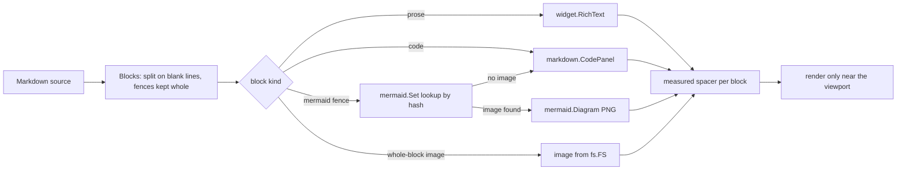

# Rendering Markdown

This page tells you how to show Markdown in a program that uses this module.
The component is `markdown.Pane`. It comes from the `markdownPane` of
clockwork-orange, spec 011 in that project, which was written after its About
section scrolled unevenly on KDE Plasma 6.

## What to use it for

- An embedded README or user guide shown in an About or Help section.
- A generated report that is already Markdown.
- Any prose longer than a few paragraphs.

For one or two sentences, use a label that wraps. For structured data, use the
detail table and not a Markdown table.

## How it renders

1. The pane divides the source into blocks at the blank lines. It follows the
   code fences, so a blank line in a fence does not divide the block.
2. The pane gives each block a kind: code in a fence, code that is indented, a
   `mermaid` fence, or prose.
3. Prose draws with `widget.NewRichTextFromMarkdown` and wraps at the words.
   Code draws in `markdown.CodePanel`, which is a monospace label on a
   rectangle in the input colour, and which wraps long lines. A mermaid fence
   draws as an embedded PNG that the pane finds by the hash of its content;
   see [mermaid.md](mermaid.md). A diagram with no image draws as a code panel
   that shows the source and says so in its caption. A block that is one image
   with a relative path comes from the `fs.FS` in `markdown.Options`, and
   draws at its natural size to a maximum of the width of the pane.
4. The pane measures each block one time at the current width, and keeps that
   height with a spacer. It draws only the blocks that are within half a
   viewport of the visible area. The other blocks are spacers.
5. The pane measures each height and does not estimate it, and it measures
   again when the width changes. The total height of the document, and the
   position of each block, are therefore the same whether or not a block is
   drawn. Nothing moves while the reader scrolls.
6. The pane does not scroll. Put the pane in your own scroller and give that
   scroller to `Follow`. `Detach` returns the scroll callback when the shell
   replaces the section. `markdown.Section` does both for a section that is
   one document.

## Why not one RichText

The `RichText` of Fyne puts every segment it holds in position and paints it
again at each refresh, and a scroller refreshes its content while it moves.
The README of clockwork-orange is 221 lines, which made approximately 250
segments. One `RichText` needed approximately 51 ms for a frame during a
scroll, in the software painter. The pane needed approximately 33 ms, and drew
21 blocks of 44.

## Why code blocks are the module's own

Fyne 2.8 puts each Markdown code block in a horizontal scroller. Fyne gives a
wheel event to the innermost scroller below the pointer and does not send it
on. That scroller changes axis when the code is wider than the pane but not
taller. A vertical movement of the wheel over a code block therefore became a
horizontal one, and the page stopped.

The code panel wraps long lines instead. Horizontal scrolling would be easier
to read, but it hides the rest of the line behind the movement that the page
itself needs. A canary test asserts that Fyne still does this. When Fyne stops,
you can remove the panel.

## Rules for authors

- Keep the documentation in one place. If the program has a README, embed it
  and show it. Do not write it again in the window.
- The pane resolves a relative image path through the `fs.FS` you give it,
  relative to `Options.Dir`. It does this only when the image is a block of
  its own, which is `` on a line of its own. An image in a
  paragraph goes to the image segment of Fyne, which cannot read an embedded
  file system.
- Use a code fence with a language rather than indented code. Both draw the
  same, but the fence names the language for a person who reads the source.
- A mermaid fence must have an image in the diagram set of the program. If it
  has none, the pane shows the source. `make generate` makes the images.
- The `RichText` of Fyne supports headings, lists, emphasis, links and inline
  code. The pane draws a pipe table itself, as a grid of cells, because the
  table segment of Fyne is in a scroller that would receive the wheel. For
  data that a program calculates, use the detail table instead.

## Testing

`fynetest.ScrollableIn(obj)` walks an object that is drawn and reports whether
it contains a scroller. The test of a document asserts `!ScrollableIn` for each
block. `fynetest.TextIn(obj)` reads the text out, so a test can assert the
content and does not need to know the layout.
