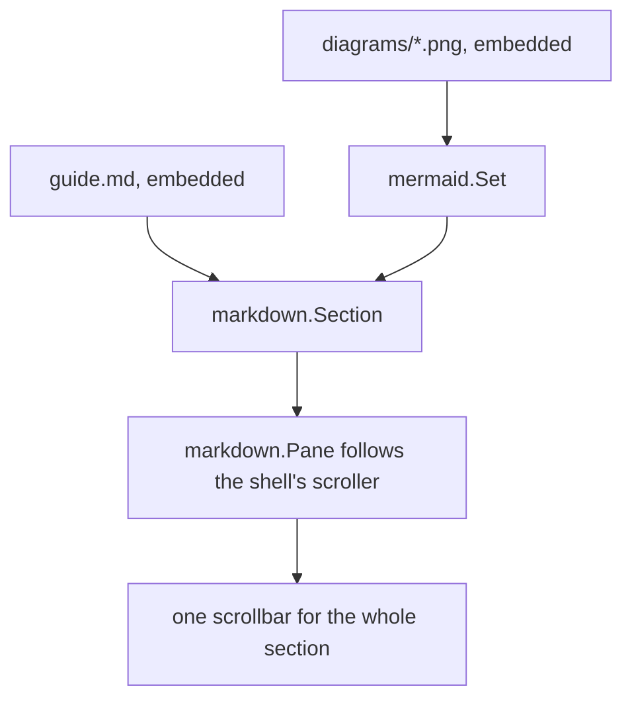

# Document viewer

This program shows a Markdown document through `markdown.Section`: rendered per
block near the viewport, with code blocks drawn by the library and a diagram
rendered ahead of time by `go generate`.

## How the pieces fit

## Code stays on the page

    go generate ./...
    go run ./examples/document-viewer

Indented and fenced code both render in a panel that wraps long lines rather
than scrolling sideways, so the wheel always belongs to the document.

## Tables are grids

| Piece | Package |
|---|---|
| Document pane | `markdown` |
| Diagram lookup | `mermaid` |
| Window skeleton | `shell` |

## A longer stretch

The rest of this file exists to make the document taller than the window, so
the pane has something to virtualise. Only the blocks within half a viewport
of what is on screen are rendered; the others are spacers of the measured
height, so the scrollbar never jumps.

Paragraph two of the filler. Nothing in here is important; scroll on.

Paragraph three of the filler, with `inline code` and **bold text** to show
that inline Markdown survives.

Paragraph four. A list follows.

- One item
- Another item
- A third, longer item that wraps when the window is narrow enough to need it,
  which the pane handles by measuring again on resize.

Paragraph five. That is enough filler.
